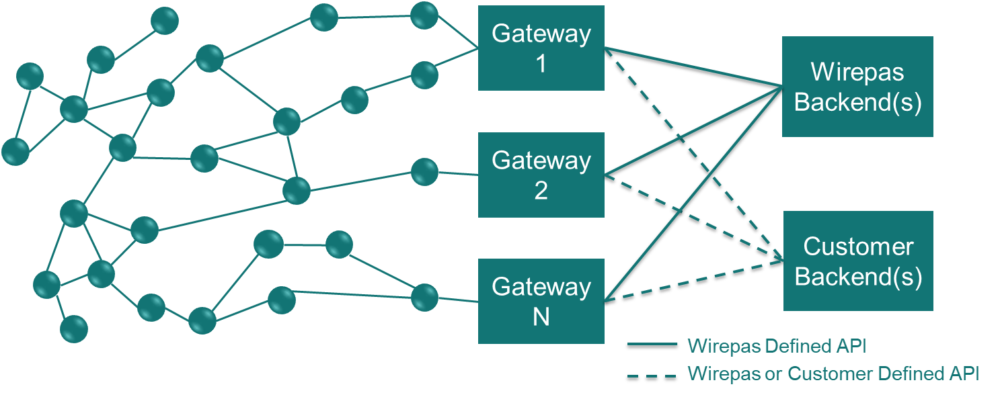

# API between a Gateway and Wirepas Backends

<!--- Version: v1.1A
API Version {#api-version .ListParagraph}
===========

+-----------------------+-----------------------+-----------------------+
| **Version**           | **WP-RM-128 version** | **Description**       |
+=======================+=======================+=======================+
| **1**                 | This document (v1.1A) | Changes:              |
|                       |                       |                       |
|                       |                       | -   *is\_fast\_transm |
|                       |                       | ission*               |
|                       |                       |     field from        |
|                       |                       |     [SendPacketReq](# |
|                       |                       | protocol-buffers-form |
|                       |                       | at-3)                 |
|                       |                       |     structure is      |
|                       |                       |     renamed           |
|                       |                       |     *is\_unack\_csma\ |
|                       |                       | _ca*                  |
|                       |                       |     to reflect        |
|                       |                       |     official feature  |
|                       |                       |     name.             |
|                       |                       |                       |
|                       |                       | -   New [gateway info |
|                       |                       |     services](#get-ga |
|                       |                       | teway-info)           |
|                       |                       |     added in API.     |
+-----------------------+-----------------------+-----------------------+
| **0**                 | v1.0A                 | Initial released      |
|                       |                       | version               |
+-----------------------+-----------------------+-----------------------+
--->

<!-- MarkdownTOC levels="1,2,3" autolink="true"  -->

1. [Introduction](#introduction)
1. [Overview of gateway features](#overview-of-gateway-features)
1. [Unique identifier](#unique-identifier)
    1. [Gateway and sinks](#gateway-and-sinks)
    1. [Request unique identifier](#request-unique-identifier)
1. [API description](#api-description)
    1. [Gateway status module](#gateway-status-module)
    1. [Config module](#config-module)
    1. [Data module](#data-module)
    1. [OTAP module](#otap-module)
1. [API extension](#api-extension)
1. [Implementation and workflow example for backends](#implementation-and-workflow-example-for-backends)
    1. [General remarks](#general-remarks)
    1. [Backend for network configuration](#backend-for-network-configuration)
    1. [Backend for data exchanges](#backend-for-data-exchanges)
1. [List of all MQTT topics](#list-of-all-mqtt-topics)

<!-- /MarkdownTOC -->

## Introduction

A Wirepas network contains nodes (router nodes and non-routers nodes)
and one or more gateways that can have multiple sinks attached.

The gateway's objective is to transfer data between Wirepas network and
backends (servers) upstream and downstream. A network can be connected through
its gateways to multiple backends.

Wirepas has developed its own backends and especially the Wirepas
Network Tool (WNT) to monitor the network behavior. To send data from a
gateway to a Wirepas Backends, the gateway must be compliant with the
API described in this document and from now on known as backend to gateway API.

The backend to gateway API is based on a set of MQTT topics where messages are encoded as [Protocol Buffers (syntax 2)][protobuf_homepage]. All the messages in the MQTT topics have the same
[root message][message_GenericMessage].

The following diagram describes the topology of a full Wirepas solution
network. There are several gateways with multiple sinks and multiple
backends running in parallel.




## Overview of gateway features

A gateway is an interface between a Wirepas Mesh network and cloud services.
The gateway exposes local capabilities that allow the cloud services to
configure and operate a Wirepas Mesh network.

The gateway services are classified in the following groups:

-   **Gateway status**: Services for monitoring the gateway itself and mainly the status of the connection with the MQTT broker;
-   **Config**: Services to configure the local sinks attached to the gateway;
-   **Data**: Services to send and receive data to/from a Wirepas network;
-   **OTAP**: Services to manage the local OTAP operation.

## Unique identifier

As a Wirepas system solution can contain multiple gateways (with
multiple sinks) connected to multiple backends as described in the
introduction each element must have its unique identifier.

### Gateway and sinks

A gateway must generate a unique id that remains the same all along the
product life. This id must be encodable in ASCII as it is used inside
MQTT topics. This id is referred as *\<gw-id>* in this document.

The uniqueness must be ensured between all gateways registered to the
**same MQTT broker**. A good id could be made with the gateway model as a
prefix followed by a generated random suffix with enough values to
ensure its uniqueness.

As a gateway can have multiple sinks attached, it is the gateway's
responsibility to identify the different sinks. This id must also be
encodable as ASCII for the same reason. This id is referred as
*\<sink-id>* in this document: sink0, sink1, sink2, ... is often used
to identify the different sinks.

The combination of *\<gw-id>/\<sink-id>* allows to unambiguously
identify a sink.

### Request unique identifier

Multiple backends can simultaneously send requests to the same gateway
(on same topic). To correlate the answers to the requests, each request
must have a unique id.

This id is referred as *\<req-id>* in this document, a 64 bits field.

At least 48 bits must be randomly generated by the backend to guarantee
the uniqueness of the request id between backends.

This request identifier is reported by the gateways in all response header. The only exception is for asynchronous responses generated by a gateway
without a prior request by the backend. The reason for such exception
is to avoid having further topics to subscribe and publish to.

## API description

This section introduces the API's MQTT topics and its contents and is
split in several subsections, one for each module:

1. [Gateway status module](#gateway-status-module)
1. [Config module](#config-module)
1. [Data module](#data-module)
1. [OTAP module](#otap-module)

Each subsection contains the relevant topic and the payload carried
by it. This sections point out the specific protocol buffer message
that must be implemented within the common
[Generic Message][message_GenericMessage]. Please refer to
[API extension](#api-extension) for further details.

In MQTT, the QoS is an important concept. Most of the gateway to broker
communication should happen with QoS2 to be sure the messages are
received or published one and only one time. However, as many packets
can be received from a network and multiple gateways can publish on the
same broker, message received event should be published with QoS1.
Depending on the quality of the connection between gateway and Backends,
it can create duplicates that will have to be filtered by the backends.
To ease this filtering, each event contains a unique identifier (random
64 bits value) in its header.

### Gateway status module

---

This module oversees the discovery of gateways for the different
backends. It also allows the backends to monitor the gateways status.

#### Status message

> **topic:**
> gw-event/status/*\<gw_id\>*
>
> **content:**
> [GenericMessage][message_GenericMessage].[WirepasMessage][message_WirepasMessage].[StatusEvent][message_StatusEvent]

The message must have the retained flag set to true to allow a new
backend to immediately be noticed of all the available gateways when
subscribing to this topic.

Once connected to the MQTT broker, status must be set to *ONLINE*.

#### Last will message

Same message with a status set to *OFFLINE* must be set by the gateway as
a **last will message**.

It will allow backends to easily see which gateway is offline.

#### Keep alive message

This API doesn't enforce the usage of a keep alive message by a gateway
to avoid additional constraints on the gateway implementation. In fact,
it implies the generation of a PING request to the broker if there is no
message generated within a keep alive interval.

Nevertheless, it is recommended to use the keep alive mechanism of MQTT
to overcome the half-open connection issue of a TCP connection.

The broker will disconnect a client if no message is received within one
and a half times of the keep alive interval and the last will message
will be sent. It allows the backends to be notified in a really short
period of a problem with a gateway connection.

60s is a good value for the keep alive interval.

### Config module

---

This module oversees configuration of the different sinks attached to
the gateway.

#### Get configs message

- **Request:**

    > **topic:** gw-request/get_configs/*\<gw-id\>*
    >
    > **content:** [GenericMessage][message_GenericMessage].[WirepasMessage][message_WirepasMessage].[GetConfigsReq][message_GetConfigsReq]

- **Response:**

    > **topics:** gw-response/get_configs/*\<gw-id\>*
    >
    > **content:** [GenericMessage][message_GenericMessage].[WirepasMessage][message_WirepasMessage].[GetConfigsResp][message_GetConfigsResp]
    >              and [GenericMessage][message_GenericMessage].[WirepasMessage][message_WirepasMessage].[SinkReadConfig][message_SinkReadConfig]

:warning:

_A gateway must generate a [GetConfigsResp][message_GetConfigsResp]
with a request id set to 0 in its header when its configuration change.
When a sink is added or removed for example.
It is the only way for a backend to monitor this change without
having to frequently poll for such event._

#### Set config message

-  **Request:**

    > **topic:** gw-request/set_config/*\<gw-id\>/\<sink-id\>*
    >
    > **content:** [GenericMessage][message_GenericMessage].[WirepasMessage][message_WirepasMessage].[SetConfigReq ][message_SetConfigReq] and [GenericMessage][message_GenericMessage].[WirepasMessage][message_WirepasMessage].[SinkNewConfig][message_SinkNewConfig]

- **Response:**

    > **topics:** gw-response/set_config/*\<gw-id\>/\<sink-id\>*
    >
    > **content:** [GenericMessage][message_GenericMessage].[WirepasMessage][message_WirepasMessage].[SetConfigResp][message_SetConfigResp]

:warning:

_A gateway must generate a [SetConfigResp][message_SetConfigResp]
with a request id set to 0 in its header when a sink state
change, especially if it reboots. In fact, if sink configuration
is changed through remote api, it is the only way for a backend
to monitor this change._

#### Get gateway info

- **Request:**

    > **topic:** gw-request/get_gateway_info/*\<gw-id\>*
    >
    > **content:** [GenericMessage][message_GenericMessage].[WirepasMessage][message_WirepasMessage].[GetGwInfoReq][message_GetGwInfoReq]

- **Response:**

    > **topics:** gw-response/set_config/*\<gw-id\>/\<sink-id\>*
    >
    > **content:** [GenericMessage][message_GenericMessage].[WirepasMessage][message_WirepasMessage].[GetGwInfoResp][message_GetGwInfoResp] and [GenericMessage][message_GenericMessage].[WirepasMessage][message_WirepasMessage].[GatewayInfo][message_GatewayInfo]

:warning:

_The API field should not be explicitly set from code and default value
must be kept. Default value is incremented by Wirepas for each release._

_Even if this version is increased, the API remains backward compatible.
It just help backends development to identify if new features are
present in a gateway._

### Data module

---

#### Send packet message

- **Request:**

    > **topic:** gw-request/send_data/*\<gw-id\>/\<sink-id\>*
    >
    > **content:** [GenericMessage][message_GenericMessage].[WirepasMessage][message_WirepasMessage].[SendPacketReq][message_SendPacketReq]

- **Response:**

    > **topics:** gw-response/send_data/*\<gw-id\>/\<sink-id\>*
    >
    > **content:** [GenericMessage][message_GenericMessage].[WirepasMessage][message_WirepasMessage].[SendPacketResp][message_SendPacketResp]

#### Packet received event

> **topic:** gw-event/received_data/*\<gw-id\>/\<sink-id\>/\<net_id\>/\<src_ep\>/\<dst_ep\>*
>
> **content:** [GenericMessage][message_GenericMessage].[WirepasMessage][message_WirepasMessage].[PacketReceivedEvent][message_PacketReceivedEvent]

##### QoS

As described in the beginning of this chapter, it is recommended to
publish this event with a QoS1 to avoid loading too much the broker.

:warning:

_To take full advantage of WNT Wirepas backend and have the correct
visualization of network activity, all received messages must be
published on this topic._

_But for security reason in some use cases, it may be required that
application payload is sent through a different channel without passing
through the MQTT broker._

_This is the main reason for the "payload" and "payload size" fields to
be optional. In fact, WNT doesn't need the application payload content
to work properly, headers are enough._

_If payload is not published, setting the payload size is a good
information for WNT. And if payload is published, payload_size can be
omitted as already available from payload field._

_Even if WNT Wirepas backend can operate without the payload, it may not
be the case for other backends implementing this API._

_Consequently, it is highly recommended to keep this field._

### OTAP module

---

#### Get local scratchpad status

- **Request:**

    > **topic:** gw-request/otap_status/*\<gw-id\>/\<sink-id\>*
    >
    > **content:** [GenericMessage][message_GenericMessage].[WirepasMessage][message_WirepasMessage].[GetScratchpadStatusReq][message_GetScratchpadStatusReq]

- **Response:**

    > **topics:** gw-response/otap_status/*\<gw-id\>/\<sink-id\>*
    >
    > **content:** [GenericMessage][message_GenericMessage].[WirepasMessage][message_WirepasMessage].[GetScratchpadStatusRes][message_GetScratchpadStatusRes]

#### Upload local scratchpad

- **Request:**

    > **topic:** gw-request/otap_load_scratchpad/*\<gw-id\>/\<sink-id\>*
    >
    > **content:** [GenericMessage][message_GenericMessage].[WirepasMessage][message_WirepasMessage].[UploadScratchpadReq][message_UploadScratchpadReq]

- **Response:**

    > **topics:** gw-response/otap_status/*\<gw-id\>/\<sink-id\>*
    >
    > **content:** [GenericMessage][message_GenericMessage].[WirepasMessage][message_WirepasMessage].[UploadScratchpadResp][message_UploadScratchpadResp]

#### Process local scratchpad

- **Request:**

    > **topic:** gw-request/otap_process_scratchpad/*\<gw-id\>/\<sink-id\>*
    >
    > **content:** [GenericMessage][message_GenericMessage].[WirepasMessage][message_WirepasMessage].[ProcessScratchpadReq][message_ProcessScratchpadReq]

- **Response:**

    > **topics:** gw-response/otap_status/*\<gw-id\>/\<sink-id\>*
    >
    > **content:** [GenericMessage][message_GenericMessage].[WirepasMessage][message_WirepasMessage].[ProcessScratchpadResp][message_ProcessScratchpadResp]

## API extension

This API is the minimal set of services to be integrated to be
compatible with Wirepas backends.

Any payload format can be extended to feat specific gateway needs. And
new topics can be added on top of those ones.

To ease API extension by every gateway manufacturer without breaking
compatibility with different backends provider, every message has the
same [GenericMessage][message_GenericMessage] root type
that contains an optional [CustomerMessage][message_CustomerMessage],
such as:

```protobuf
    message WirepasMessage {
        optional StatusEvent status_event = 1;
        optional GetConfigsReq get_configs_req = 2;
        ... // All possible specific payloads
    }

    message CustomerMessage {
        // Customer name is needed to avoid any collision between
        different customer implementation
        required string customer_name = 1;
        // Can be freely used for enhancing API by customers
    }

    message GenericMessage {
        optional WirepasMessage wirepas = 1;
        optional CustomerMessage customer = 2;
    }
```

As the customer field is optional, it will not affect the Wirepas
backends that will not have the knowledge of such field.

For example, the status message can be extended with more information on
the gateway itself for gateway specific information like the model and
any useful information.

## Implementation and workflow example for backends

### General remarks

-   A backend must know the MQTT broker that is used by the gateway(s)
    in the network;

-   There is relevant information present in both the MQTT topic and Protocol
    Buffers payload. Reason is to allow more flexibility in implementation.
    Filtering can be done on topics or by parsing the payload format.

### Backend for network configuration

This section describes the workflow for a backend that oversees the
network configuration. Usually, only one backend has this function in a
full product to avoid any mismatch configuration that cannot be avoided
by the gateway itself. WNT developed by Wirepas can be used for this
function.

#### Initialization

Once connected to the broker, the backend must subscribe to the
*gw-event/status/+* topic to discover the different gateways registered
to that broker.

As all gateways post a retained message on that topic with their status,
the backend will immediately know the list of gateways connected to this
broker.

Backend can ask each gateway, its list of attached sinks by publishing a
message on *gw-request/\<gw-id\>/get_configs* topic and the backend
should subscribe to *gw-response/get_configs/\<gw-id\>* topic to
receive the answer from a specific gateway or
*gw-response/get_configs/+* topic for all gateways.

#### Sink(s) configuration

Each sink can be configured and started/stopped by publishing a message
on *gw-request/\<gw-id>/\<sink-id\>/set_config*.

The gateway will publish back a message on
*gw-response/set_config/\<gw-id\>/\<sink-id\>* topic with the result of
configuration and the full new configuration.

#### OTAP

A new scratchpad can be loaded and processed by sinks attached to the
gateway with messages described in the OTAP section.

All the remote procedure is managed by the dedicated remote API.

### Backend for data exchanges

This section describes the work flow for a backend that just want to
send/receive application data to/from a Wirepas network.

In a simple use case, a backend waiting for messages on endpoint 10 from
network 12345 must only subscribe to topic
*gw-event/received_data/+/+/12345/10/+*

And messages can be sent to the network from a given sink by publishing
on topic: *gw-request/send_data/\<gw-id\>/\<sink-id\>*

## List of all MQTT topics

Here is a list of the different MQTT topics for a global view of the
interface between a backend and a gateway (without the payload
definition)

*Request* from a backend to a gateway:

```mqtt
    gw-request/get_configs/<gw-id>

    gw-request/get_gw_info/<gw-id>

    gw-request/set_config/<gw-id>/<sink-id>

    gw-request/send_data/<gw-id>/<sink-id>

    gw-request/otap_status/<gw-id>/<sink-id>

    gw-request/otap_load_scratchpad/<gw-id>/<sink-id>

    gw-request/otap_process_scratchpad/<gw-id>/<sink-id>
```

*Response* from a gateway to a backend:

```mqtt
    gw-response/get_configs/<gw-id>

    gw-response/get_gw_info/<gw-id>

    gw-response/set_config/<gw-id>/<sink-id>

    gw-response/send_data/<gw-id>/<sink-id>

    gw-response/otap_status/<gw-id>/<sink-id>

    gw-response/otap_load_scratchpad/<gw-id>/<sink-id>

    gw-response/otap_process_scratchpad/<gw-id>/<sink-id>
```

*Asynchronous* event from a gateway:

```mqtt
    gw-event/status/<gw_id>

    gw-event/received_data/<gw-id>/<sink-id>/<net_id>/<src_ep>/<dst_ep>
```

<!-- Unused definitions -->
<!--
[message_NodeRole]: https://github.com/wirepas/backend-apis/blob/8580ee52eb71dbef3afce6b0207d3312153ced42/gateway_to_backend/protocol_buffers_files/config_message.proto#L8-L20

[message_AccessCycleRange]: https://github.com/wirepas/backend-apis/blob/8580ee52eb71dbef3afce6b0207d3312153ced42/gateway_to_backend/protocol_buffers_files/config_message.proto#L22-L25


[message_ChannelRange]: https://github.com/wirepas/backend-apis/blob/8580ee52eb71dbef3afce6b0207d3312153ced42/gateway_to_backend/protocol_buffers_files/config_message.proto#L27-L30

[message_AppConfigData]: https://github.com/wirepas/backend-apis/blob/8580ee52eb71dbef3afce6b0207d3312153ced42/gateway_to_backend/protocol_buffers_files/config_message.proto#L32-L36

[message_NetworkKeys]: https://github.com/wirepas/backend-apis/blob/8580ee52eb71dbef3afce6b0207d3312153ced42/gateway_to_backend/protocol_buffers_files/config_message.proto#L38-L41
-->

[message_StatusEvent]: https://github.com/wirepas/backend-apis/blob/982974eb6069d89aef527862cb7b5f1b2e2c4385/gateway_to_backend/protocol_buffers_files/config_message.proto#L110-L115

[message_GetConfigsReq]: https://github.com/wirepas/backend-apis/blob/982974eb6069d89aef527862cb7b5f1b2e2c4385/gateway_to_backend/protocol_buffers_files/config_message.proto#L117-L119

[message_GetConfigsResp]: https://github.com/wirepas/backend-apis/blob/982974eb6069d89aef527862cb7b5f1b2e2c4385/gateway_to_backend/protocol_buffers_files/config_message.proto#L121-L125

[message_SinkReadConfig]: https://github.com/wirepas/backend-apis/blob/982974eb6069d89aef527862cb7b5f1b2e2c4385/gateway_to_backend/protocol_buffers_files/config_message.proto#L43-L68

[message_SinkNewConfig]: https://github.com/wirepas/backend-apis/blob/e984911e4c070583dfbc55f71adf1e52fcf2391a/gateway_to_backend/protocol_buffers_files/config_message.proto#L70-L87

[message_GatewayInfo]: https://github.com/wirepas/backend-apis/blob/8580ee52eb71dbef3afce6b0207d3312153ced42/gateway_to_backend/protocol_buffers_files/config_message.proto#L89-L105

[message_SetConfigReq]: https://github.com/wirepas/backend-apis/blob/8580ee52eb71dbef3afce6b0207d3312153ced42/gateway_to_backend/protocol_buffers_files/config_message.proto#L127-L131

[message_SetConfigResp]: https://github.com/wirepas/backend-apis/blob/8580ee52eb71dbef3afce6b0207d3312153ced42/gateway_to_backend/protocol_buffers_files/config_message.proto#L133-L138

[message_GetGwInfoReq]: https://github.com/wirepas/backend-apis/blob/8580ee52eb71dbef3afce6b0207d3312153ced42/gateway_to_backend/protocol_buffers_files/config_message.proto#L140-L142

[message_GetGwInfoResp]: https://github.com/wirepas/backend-apis/blob/8580ee52eb71dbef3afce6b0207d3312153ced42/gateway_to_backend/protocol_buffers_files/config_message.proto#L144-L148

[message_SendPacketReq]: https://github.com/wirepas/backend-apis/blob/8580ee52eb71dbef3afce6b0207d3312153ced42/gateway_to_backend/protocol_buffers_files/data_message.proto#L11-L26

[message_SendPacketResp]: https://github.com/wirepas/backend-apis/blob/8580ee52eb71dbef3afce6b0207d3312153ced42/gateway_to_backend/protocol_\buffers_files/data_message.proto#L28-L30

[message_PacketReceivedEvent]: https://github.com/wirepas/backend-apis/blob/8580ee52eb71dbef3afce6b0207d3312153ced42/gateway_to_backend/protocol_buffers_files/data_message.proto#L35-L50

[message_GetScratchpadStatusReq]: https://github.com/wirepas/backend-apis/blob/8580ee52eb71dbef3afce6b0207d3312153ced42/gateway_to_backend/protocol_buffers_files/otap_message.proto#L30-L32

[message_GetScratchpadStatusRes]: https://github.com/wirepas/backend-apis/blob/8580ee52eb71dbef3afce6b0207d3312153ced42/gateway_to_backend/protocol_buffers_files/otap_message.proto#L34-L42

[message_UploadScratchpadReq]: https://github.com/wirepas/backend-apis/blob/8580ee52eb71dbef3afce6b0207d3312153ced42/gateway_to_backend/protocol_buffers_files/otap_message.proto#L44-L50

[message_UploadScratchpadResp]: https://github.com/wirepas/backend-apis/blob/982974eb6069d89aef527862cb7b5f1b2e2c4385/gateway_to_backend/protocol_buffers_files/config_message.proto#L43-L68

[message_ProcessScratchpadReq]: https://github.com/wirepas/backend-apis/blob/8580ee52eb71dbef3afce6b0207d3312153ced42/gateway_to_backend/protocol_buffers_files/otap_message.proto#L56-L58

[message_ProcessScratchpadResp]: https://github.com/wirepas/backend-apis/blob/8580ee52eb71dbef3afce6b0207d3312153ced42/gateway_to_backend/protocol_buffers_files/otap_message.proto#L60-L62

[message_GenericMessage]: https://github.com/wirepas/backend-apis/blob/3a9fbfc18fb8bb6b36e0b2263c8987a17a0117e9/gateway_to_backend/protocol_buffers_files/generic_message.proto#L34-L37

[message_CustomerMessage]: https://github.com/wirepas/backend-apis/blob/3a9fbfc18fb8bb6b36e0b2263c8987a17a0117e9/gateway_to_backend/protocol_buffers_files/generic_message.proto#L28-L32

[message_WirepasMessage]: https://github.com/wirepas/backend-apis/blob/127f4a0025078aa7b118a6b10661461a50aaf33e/gateway_to_backend/protocol_buffers_files/generic_message.proto#L9-L26

[protobuf_homepage]: https://developers.google.com/protocol-buffers
