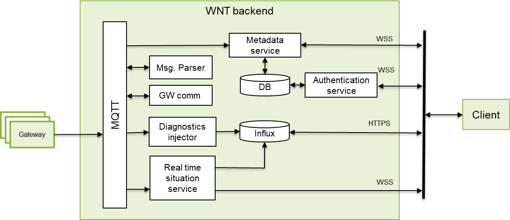

<!---
> WP-RM-129 -- WNT backend API
>
> Reference Manual

Version: v2.0A

This document describes the Wirepas Network Tool backend API.

> Public
-->

<!---
Version history
===============

+-----------------------------------+-----------------------------------+
| Version                           | Description                       |
+===================================+===================================+
| 1.6                               | Initial version                   |
+-----------------------------------+-----------------------------------+
| 1.7                               | Updated for WNT 1.7               |
|                                   |                                   |
|                                   | -   Removed warning from *Get     |
|                                   |     areas* chapter and updated    |
|                                   |     the response, as the issue    |
|                                   |     was fixed.                    |
|                                   |                                   |
|                                   | -   Removed note about *Set node  |
|                                   |     metadata* method only to      |
|                                   |     accept single entry, as it is |
|                                   |     not true anymore.             |
+-----------------------------------+-----------------------------------+
| 2.0                               | Updated for WNT 2.0               |
|                                   |                                   |
|                                   | -   Added *protocol version*      |
|                                   |     table.                        |
|                                   |                                   |
|                                   | -   Updated *protocol version*    |
|                                   |     to 3.                         |
|                                   |                                   |
|                                   | -   Added note about              |
|                                   |     *analytics\_packet*           |
|                                   |     measurement change.           |
|                                   |                                   |
|                                   | -   Added *Get components         |
|                                   |     information* and *Get         |
|                                   |     scratchpad status* methods.   |
|                                   |                                   |
|                                   | -   Added floor plan image size   |
|                                   |     to *Create* and *Update floor |
|                                   |     plan* messages.               |
|                                   |                                   |
|                                   | -   Changed *Create* and *Update  |
|                                   |     floor plan* messages to       |
|                                   |     return all floor plan fields. |
|                                   |                                   |
|                                   | -   Added coordinate conversion   |
|                                   |     related data to *Create* and  |
|                                   |     *Update floor plan* messages. |
|                                   |                                   |
|                                   | -   Changed *network* *id* to     |
|                                   |     number in *Create*, *Update   |
|                                   |     and Delete network*.          |
|                                   |                                   |
|                                   | -   Removed *pixel\_location\_x*  |
|                                   |     and *pixel\_location\_y* from |
|                                   |     *Set node metadata* message.  |
|                                   |                                   |
|                                   | -   Added *remote\_api\_response* |
|                                   |     to Influx measurements.       |
|                                   |                                   |
|                                   | -   Split *analytics\_packet*     |
|                                   |     Influx measurement's          |
|                                   |     *travel\_time\_ms* column to  |
|                                   |     *travel\_time\_ms\_qos0* and  |
|                                   |     *travel\_time\_ms\_qos1*.     |
+-----------------------------------+-----------------------------------+

-->

# WNT backend API

<!-- MarkdownTOC -->

-   [Introduction](#introduction)
-   [Backend interface components](#backend-interface-components)
    -   [Authentication service](#authentication-service)
    -   [Metadata service](#metadata-service)
    -   [Real time situation service](#real-time-situation-service)
    -   [Time series service](#time-series-service)
    -   [Protocol version](#protocol-version)
-   [Authentication service messages](#authentication-service-messages)
    -   [Login](#login)
    -   [Get users](#get-users)
    -   [Create user](#create-user)
    -   [Update user](#update-user)
    -   [Delete user](#delete-user)
-   [Metadata service messages](#metadata-service-messages)
    -   [Get buildings](#get-buildings)
    -   [Create building](#create-building)
    -   [Update building](#update-building)
    -   [Delete building](#delete-building)
    -   [Get building's floor plans](#get-buildings-floor-plans)
    -   [Create floor plan](#create-floor-plan)
    -   [Update floor plan](#update-floor-plan)
    -   [Delete floor plan](#delete-floor-plan)
    -   [Get floor plan image data](#get-floor-plan-image-data)
    -   [Set floor plan image data](#set-floor-plan-image-data)
    -   [Get areas](#get-areas)
    -   [Create area](#create-area)
    -   [Update area](#update-area)
    -   [Delete area](#delete-area)
    -   [Get networks](#get-networks)
    -   [Create network](#create-network)
    -   [Update network](#update-network)
    -   [Delete network](#delete-network)
    -   [Add node to floor plan](#add-node-to-floor-plan)
    -   [Remove node from floor plan](#remove-node-from-floor-plan)
    -   [Set node metadata](#set-node-metadata)
    -   [Delete node](#delete-node)
    -   [Set network data](#set-network-data)
    -   [Send data message](#send-data-message)
    -   [Get scratchpad status](#get-scratchpad-status)
    -   [Get components information](#get-components-information)
-   [Real time situation service authentication](#real-time-situation-service-authentication)
-   [Time series service data](#time-series-service-data)
    -   [Example CURL command to query data](#example-curl-command-to-query-data)
    -   [Example column names decoding](#example-column-names-decoding)
-   [Basic data flow and real time situation data](#basic-data-flow-and-real-time-situation-data)
    -   [Basic data flow to get continuous data](#basic-data-flow-to-get-continuous-data)
    -   [Real time situation data](#real-time-situation-data)
-   [Coordinate conversions](#coordinate-conversions)
    -   [Introduction](#introduction-1)
    -   [WGS84 to pixels](#wgs84-to-pixels)
    -   [Pixels to WGS84](#pixels-to-wgs84)
    -   [WGS84 to ECEF conversion](#wgs84-to-ecef-conversion)
    -   [ECEF to WGS84 conversion](#ecef-to-wgs84-conversion)
-   [References](#references)

<!-- /MarkdownTOC -->

# Introduction

This document describes the Wirepas Network Tool (WNT) server backend
API and is intended for Wirepas licensee to implement own services on
top of the WNT server. Prerequisites include overall knowledge of
Wirepas Mesh (WM) and WNT client. APIs are implemented on top of web
sockets and HTTP connections using JSON and Protocol Buffers (version 2)
data encoding.

This document is compliant with WNT backend version 2.0.

# Backend interface components

Backend client interface consists of four individual components which
all use secure versions of the protocols (WSS, HTTPS).

Figure 1 Simplified architecture

{width="6.820178258967629in"
height="2.9400590551181103in"}

Table 1: Components

  Component             Protocol     Port   Data encoding

* * *

  Authentication        Web socket   8813   JSON
  Metadata              Web socket   8812   JSON
  Real time situation   Web socket   8811   Protocol Buffers \*
  Time series           HTTP         8886   JSON \*\*

\* Authentication is done by using JSON

\*\* Queries are sent via HTTP GET

The MQTT connection between the gateway and WNT backend is described in
document: WP-RM-128 - API between a Gateway and Wirepas Backends.

## Authentication service

The service handles user management and access to metadata and real time
situation service. The time series service share the same credentials as
the authentication service. Any credentials changes made through
authentication service are propagated automatically to the time series
service. Credentials can only be changed via authentication service.
Other clients are notified about the users related changes (except
password changes) via real time situation connection.

## Metadata service

Metadata service provides access to:

-   node metadata

-   buildings

-   floor plans

-   areas

-   network information

-   downlink communication with the nodes

The clients are notified about the metadata changes via real time
situation connection.

## Real time situation service

The real time information of all the nodes and changes to metadata are
available from the real time situation service. After the connection is
established, and authentication has succeeded, the service will send all
real time information via the connection. When the service receives new
information from the nodes it forwards only the data that has changed to
the client connections.

## Time series service

Time series service contains diagnostics - and auxiliary data. It is
implemented as direct access to the Influx database version 1.5. For
more information please see chapter 7.

## Protocol version

Authentication, metadata and real time situation (authentication)
messages contains protocol version field. This field needs to match the
correct protocol version supported by the WNT backend. At the moment the
backend cannot handle messages of older protocol version.

Table 2: Protocol versions

  Protocol version   Backend version

* * *

  2                  1.6, 1.7
  3                  2.0

**\\
**

# Authentication service messages

Authentication service works in request / response principle. User is
automatically logged out when the connection is closed, and session id
received via login message cannot be used later. Authenticated real time
situation connection will work after the authentication service
connection is closed. Access to methods are depending on user's role.

Table 3: Roles

  Role            Number

* * *

  Administrator   1
  Operator        2

Simple rule between the roles is that operator can only query data, but
administrator can also make changes.

All requests have common version field which denotes the protocol
version and distinct type field per message type.

Table 4: Message types

  Message       Type   Role

* * *

  Login         1      All
  Get users     11     Administrator
  Create user   12     Administrator
  Update user   13     Administrator
  Delete user   14     Administrator

Due to possibility that the information about the change comes earlier
from the real time situation connection than the response from the
authentication service, some methods contain an *originator_token*
field which can be used to check if the change was originated from the
current client. The token can be e.g. UUID (version 1 / 4) as string.

Responses contains *result* field which contains information if any
error occurred.

Table 5: Result codes

  Message                                           Code

* * *

  Ok                                                1
  Generic error                                     2
  Invalid credentials while logging in              3
  Wrong protocol version                            4
  User does not have rights to perform the action   5
  Invalid user id                                   6
  User which was tried to create already exists     7
  Received message was invalid                      8
  Invalid session id                                9

User information fields have minimum and maximum lengths in characters.

Table 6: Minimum and maximum lengths

  Field        Minimum   Maximum

* * *

  username     1         63
  password     6         255
  full_name   1         255

## Login

*Login* message is used to login to the services and it returns a
session id that is used to authenticate to the metadata and real time
situation services.

Table 7: Login message

\+----------------------------------+-------------------------------------+
| Request                          | Response                            |
\+==================================+=====================================+
| {                                | {                                   |
\|                                  \|                                     \|
| \\"data\\": {                      | \\"data\\": {                         |
\|                                  \|                                     \|
| \\"username\\": \\"\\&lt;user name>\\", | \\"role\\": 1,                        |
\|                                  \|                                     \|
| \\"password\\": \\"\\&lt;password>\\"   | \\"session_id\\": \\"\\&lt;session id>\\" |
\|                                  \|                                     \|
| },                               | },                                  |
\|                                  \|                                     \|
| \\"type\\": 1,                     | \\"result\\": 1,                      |
\|                                  \|                                     \|
| \\"version\\": 3                   | \\"type\\": 1,                        |
\|                                  \|                                     \|
| }                                | \\"version\\": 3                      |
\|                                  \|                                     \|
|                                  | }                                   |
\+----------------------------------+-------------------------------------+

## Get users

Message returns list of users and users' information.

Table 8:Get users message

\+--------------------------------------+-------------------------------+
| Request                              | Example response              |
\+======================================+===============================+
| {                                    | {                             |
\|                                      \|                               \|
| \\"data\\": {},                        | \\"data\\": {                   |
\|                                      \|                               \|
| \\"session_id\\": \\"\\&lt;session id>\\", | \\"users\\": \[                 \|
\|                                      \|                               \|
| \\"type\\": 11,                        | {                             |
\|                                      \|                               \|
| \\"version\\": 3                       | \\"full_name\\": \\"John Doe\\", |
\|                                      \|                               \|
| }                                    | \\"role\\": 2,                  |
\|                                      \|                               \|
|                                      | \\"username\\": \\"johndoe\\"     |
\|                                      \|                               \|
|                                      | },                            |
\|                                      \|                               \|
|                                      | {                             |
\|                                      \|                               \|
|                                      | \\"full_name\\": \\"Jane Doe\\", |
\|                                      \|                               \|
|                                      | \\"role\\": 1,                  |
\|                                      \|                               \|
|                                      | \\"username\\": \\"janedoe\\"     |
\|                                      \|                               \|
|                                      | }                             |
\|                                      \|                               \|
\|                                      \| ]                            \|
\|                                      \|                               \|
|                                      | },                            |
\|                                      \|                               \|
|                                      | \\"result\\": 1,                |
\|                                      \|                               \|
|                                      | \\"type\\": 11,                 |
\|                                      \|                               \|
|                                      | \\"version\\": 3                |
\|                                      \|                               \|
|                                      | }                             |
\+--------------------------------------+-------------------------------+

## Create user

New user can be created with *create user* message. Only a single user
can be created with the message although *users* field is an array.

Updates are sent to clients via real time situation connection using\\
*metadata_update_message -> added_or_changed_users* message.

Table 9: Create user message

\+---------------------------------------+----------------+
| Request                               | Response       |
\+=======================================+================+
| {                                     | {              |
\|                                       \|                \|
| \\"data\\": {                           | \\"data\\": {},  |
\|                                       \|                \|
| \\"originator_token\\": \\"\\&lt;token>\\", | \\"result\\": 1, |
\|                                       \|                \|
| \\"users\\": \[                         | \\"type\\": 12,  |
\|                                       \|                \|
| {                                     | \\"version\\": 3 |
\|                                       \|                \|
| \\"full_name\\": \\"\\&lt;first last>\\",   | }              |
\|                                       \|                \|
| \\"password\\": \\"\\&lt;password>\\",       |                |
\|                                       \|                \|
| \\"role\\": \\&lt;role>,                   |                |
\|                                       \|                \|
| \\"username\\": \\"\\&lt;user name>\\"       |                |
\|                                       \|                \|
| }                                     |                |
\|                                       \|                \|
\| ]                                    \|                \|
\|                                       \|                \|
| },                                    |                |
\|                                       \|                \|
| \\"session_id\\": \\"\\&lt;session id>\\",  |                |
\|                                       \|                \|
| \\"type\\": 12,                         |                |
\|                                       \|                \|
| \\"version\\": 3                        |                |
\|                                       \|                \|
| }                                     |                |
\+---------------------------------------+----------------+

## Update user

User can be updated with *update user* message. Only a single user can
be updated with the message although *users* field is an array. In user
data only *username* field is required.

Updates are sent to clients via real time situation connection using\\
*metadata_update_message -> added_or_changed_users* message.

Table 10: Update user message

\+-----------------------------------------+----------------+
| Request                                 | Response       |
\+=========================================+================+
| {                                       | {              |
\|                                         \|                \|
| \\"data\\": {                             | \\"data\\": {},  |
\|                                         \|                \|
| \\"originator_token\\": \\"\\&lt;token>\\",   | \\"result\\": 1, |
\|                                         \|                \|
| \\"users\\": \[                           | \\"type\\": 13,  |
\|                                         \|                \|
| {                                       | \\"version\\": 3 |
\|                                         \|                \|
| \\"full_name\\": \\"\\&lt;new first last>\\", | }              |
\|                                         \|                \|
| \\"password\\": \\"\\&lt;new password>\\",     |                |
\|                                         \|                \|
| \\"role\\": \\&lt;new role>,                 |                |
\|                                         \|                \|
| \\"username\\": \\"\\&lt;new user name>\\"     |                |
\|                                         \|                \|
| }                                       |                |
\|                                         \|                \|
\| ]                                      \|                \|
\|                                         \|                \|
| },                                      |                |
\|                                         \|                \|
| \\"session_id\\": \\"\\&lt;session id>\\",    |                |
\|                                         \|                \|
| \\"type\\": 13,                           |                |
\|                                         \|                \|
| \\"version\\": 3                          |                |
\|                                         \|                \|
| }                                       |                |
\+-----------------------------------------+----------------+

## Delete user

User can be deleted with *delete user* message. Only a single user can
be deleted with the message although *users* field is an array.

Updates are sent to clients via real time situation connection using\\
*metadata_update_message -> deleted_users* message.

Table 11: Delete user message

\+---------------------------------------+----------------+
| Request                               | Response       |
\+=======================================+================+
| {                                     | {              |
\|                                       \|                \|
| \\"data\\": {                           | \\"data\\": {},  |
\|                                       \|                \|
| \\"originator_token\\": \\"\\&lt;token>\\", | \\"result\\": 1, |
\|                                       \|                \|
| \\"users\\": \[                         | \\"type\\": 14,  |
\|                                       \|                \|
| {                                     | \\"version\\": 3 |
\|                                       \|                \|
| \\"username\\": \\"\\&lt;user name>\\"       | }              |
\|                                       \|                \|
| }                                     |                |
\|                                       \|                \|
\| ]                                    \|                \|
\|                                       \|                \|
| },                                    |                |
\|                                       \|                \|
| \\"session_id\\": \\"\\&lt;session id>\\",  |                |
\|                                       \|                \|
| \\"type\\": 14,                         |                |
\|                                       \|                \|
| \\"version\\": 3                        |                |
\|                                       \|                \|
| }                                     |                |
\+---------------------------------------+----------------+

# Metadata service messages

Metadata service works in request / response principle. All the messages
require *session id*, which can be get from authentication service.

All requests have a common *version* field which denotes the protocol
version and distinct *type* field per message type.

Table 12: Message types

  Message                                 Type   Role

* * *

  Get buildings                           1001   All
  Create building                         1002   Administrator
  Update building                         1003   Administrator
  Delete building                         1004   Administrator
  Get building's floor plans              1011   All
  Create floor plan                       1012   Administrator
  Update floor plan                       1013   Administrator
  Delete floor plan                       1014   Administrator
  Get floor plan image data               1021   All
  Set floor plan image data               1022   Administrator
  Get map areas                           1031   All
  Create map area                         1032   Administrator
  Update map area                         1033   Administrator
  Delete map area                         1034   Administrator
  Get networks                            1041   All
  Create network                          1042   Administrator
  Update network                          1043   Administrator
  Delete network                          1044   Administrator
  Add node to floor plan                  1051   Administrator
  Remove node from floor plan             1052   Administrator
  Set node metadata                       1061   Administrator
  Change node id and / or network id \*   1062   Administrator
  Delete node                             1063   Administrator
  Set network data                        1071   Administrator
  Send Remote API request \*              1072   Administrator
  Send data message                       1073   Administrator
  Get scratchpad status                   1074   Administrator
  Load scratchpad \*                      1075   Administrator
  Get components information              1081   All

\* Message will be documented later

Due to possibility that the information about the change comes earlier
from the real time situation connection than the response from the
metadata service, some methods contain an *originator_token* field
which can be used to check if the change was originated from the current
client. The token can be e.g. UUID (version 1 / 4) as string.

Responses contains *result* field which contains information if any
error occurred.

Table 13: Result codes

  Message                                           Code

* * *

  Ok                                                1
  Generic error                                     2
  Wrong protocol version                            4
  User does not have rights to perform the action   5
  Invalid id (building, floor plan, area etc.)      6
  Received message was invalid                      8
  Invalid session id                                9

## Get buildings

The message returns name and id of all the buildings.

Table 14: Get buildings message

\+-----------------------------------+-----------------------------------+
| Request                           | Example response                  |
\+===================================+===================================+
| {                                 | {                                 |
\|                                   \|                                   \|
| \\"data\\": {                       | \\"data\\": {                       |
\|                                   \|                                   \|
| \\"originator_token\\":            | \\"buildings\\": \[                 \|
| \\"\\&lt;token>\\"                     |                                   |
|                                   | {                                 |
| },                                |                                   |
|                                   | \\"id\\":                           |
| \\"session_id\\": \\"\\&lt;session      | \\"c6ddb790-24e4-6449-075a-a6638f1 |
| id>\\",                           | 47812\\",                          |
\|                                   \|                                   \|
| \\"type\\": 1001,                   | \\"name\\": \\"Main building\\"       |
\|                                   \|                                   \|
| \\"version\\": 3                    | },                                |
\|                                   \|                                   \|
| }                                 | {                                 |
\|                                   \|                                   \|
|                                   | \\"id\\":                           |
|                                   | \\"e936d185-42db-ff18-57b5-4deb02d |
|                                   | 05c58\\",                          |
\|                                   \|                                   \|
|                                   | \\"name\\": \\"Other building\\"      |
\|                                   \|                                   \|
|                                   | }                                 |
\|                                   \|                                   \|
\|                                   \| ]                                \|
\|                                   \|                                   \|
|                                   | },                                |
\|                                   \|                                   \|
|                                   | \\"result\\": 1,                    |
\|                                   \|                                   \|
|                                   | \\"type\\": 1001,                   |
\|                                   \|                                   \|
|                                   | \\"version\\": 3                    |
\|                                   \|                                   \|
|                                   | }                                 |
\+-----------------------------------+-----------------------------------+

## Create building

New building can be created with *create building* message which returns
building id that can be used later to reference the building. Only a
single building can be created with the message although *buildings*
field is an array.

Updates are sent to clients via real time situation connection using\\
*metadata_update_message -> added_or_changed_buildings* message.

Table 15: Create building message

\+--------------------------------------+-----------------------------+
| Request                              | Response                    |
\+======================================+=============================+
| {                                    | {                           |
\|                                      \|                             \|
| \\"data\\": {                          | \\"data\\": {                 |
\|                                      \|                             \|
| \\"buildings\\": \[                    | \\"buildings\\": \[           \|
\|                                      \|                             \|
| {                                    | {                           |
\|                                      \|                             \|
| \\"name\\": \\"\\&lt;building name>\\"      | \\"id\\": \\"\\&lt;building id>\\" |
\|                                      \|                             \|
| }                                    | }                           |
\|                                      \|                             \|
\| ],                                  | ]                          \|
\|                                      \|                             \|
| \\"originator_token\\": \\"\\&lt;token>\\" | },                          |
\|                                      \|                             \|
| },                                   | \\"result\\": 1,              |
\|                                      \|                             \|
| \\"session_id\\": \\"\\&lt;session id>\\", | \\"type\\": 1002,             |
\|                                      \|                             \|
| \\"type\\": 1002,                      | \\"version\\": 3              |
\|                                      \|                             \|
| \\"version\\": 3                       | }                           |
\|                                      \|                             \|
| }                                    |                             |
\+--------------------------------------+-----------------------------+

## Update building

Building name can be updated with *update building* message. Only a
single building can be updated with the message although *buildings*
field is an array.

Updates are sent to clients via real time situation connection using\\
*metadata_update_message -> added_or_changed_buildings* message.

Table 16: Update building message

\+-----------------------------------------+-----------------+
| Request                                 | Response        |
\+=========================================+=================+
| {                                       | {               |
\|                                         \|                 \|
| \\"data\\": {                             | \\"data\\": {},   |
\|                                         \|                 \|
| \\"buildings\\": \[                       | \\"result\\": 1,  |
\|                                         \|                 \|
| {                                       | \\"type\\": 1003, |
\|                                         \|                 \|
| \\"id\\": \\"\\&lt;building id>\\",            | \\"version\\": 3  |
\|                                         \|                 \|
| \\"name\\": \\"\\&lt;updated building name>\\" | }               |
\|                                         \|                 \|
| }                                       |                 |
\|                                         \|                 \|
\| ],                                     |                 |
\|                                         \|                 \|
| \\"originator_token\\": \\"\\&lt;token>\\"    |                 |
\|                                         \|                 \|
| },                                      |                 |
\|                                         \|                 \|
| \\"session_id\\": \\"\\&lt;session id>\\",    |                 |
\|                                         \|                 \|
| \\"type\\": 1003,                         |                 |
\|                                         \|                 \|
| \\"version\\": 3                          |                 |
\|                                         \|                 \|
| }                                       |                 |
\+-----------------------------------------+-----------------+

## Delete building

Building can be deleted with *delete building* message. Only a single
building can be deleted with the message although *buildings* field is
an array.

Updates are sent to clients via real time situation connection using\\
*metadata_update_message -> deleted_buildings* message.

Table 17: Delete building message

\+--------------------------------------+-----------------+
| Request                              | Response        |
\+======================================+=================+
| {                                    | {               |
\|                                      \|                 \|
| \\"data\\": {                          | \\"result\\": 1,  |
\|                                      \|                 \|
| \\"buildings\\": \[                    | \\"type\\": 1004, |
\|                                      \|                 \|
| {                                    | \\"version\\": 3  |
\|                                      \|                 \|
| \\"id\\": \\"\\&lt;building id>\\"          | }               |
\|                                      \|                 \|
| }                                    |                 |
\|                                      \|                 \|
\| ],                                  |                 |
\|                                      \|                 \|
| \\"originator_token\\": \\"\\&lt;token>\\" |                 |
\|                                      \|                 \|
| },                                   |                 |
\|                                      \|                 \|
| \\"session_id\\": \\"\\&lt;session id>\\", |                 |
\|                                      \|                 \|
| \\"type\\": 1004,                      |                 |
\|                                      \|                 \|
| \\"version\\": 3                       |                 |
\|                                      \|                 \|
| }                                    |                 |
\+--------------------------------------+-----------------+

## Get building's floor plans

The message returns information about the floor plans in a building.
Only a single building's floor plans can be fetched with the message
although *buildings* field is an array.

The *rotation_matrix*, *offset_ecef_to_local,
offset_local_to_ecef* and *pixels_per_meter* fields are used for
mapping between WGS84 and pixel coordinates. For more information please
see chapter 9.

Table 18: Get building's floor plans message

\+-----------------------------------+-----------------------------------+
| Request                           | Example response (only one floor  |
|                                   | plan)                             |
\+===================================+===================================+
| {                                 | {                                 |
\|                                   \|                                   \|
| \\"data\\": {                       | \\"data\\": {                       |
\|                                   \|                                   \|
| \\"buildings\\": \[                 | \\"buildings\\": \[                 \|
\|                                   \|                                   \|
| {                                 | {                                 |
\|                                   \|                                   \|
| \\"id\\": \\"\\&lt;building id>\\"       | \\"id\\":                           |
|                                   | \\"3b326217-676d-f547-019b-6d8e0e1 |
| }                                 | fc5dc\\",                          |
\|                                   \|                                   \|
\| ],                               | \\"floor_plans\\": \[              \|
\|                                   \|                                   \|
| \\"originator_token\\":            | {                                 |
| \\"\\&lt;token>\\"                     |                                   |
|                                   | \\"id\\":                           |
| },                                | \\"1e19239c-bcd2-829a-44a1-900e083 |
|                                   | f0bfe\\",                          |
| \\"session_id\\": \\"\\&lt;session      |                                   |
| id>\\",                           | \\"name\\": \\"New floor plan\\",     |
\|                                   \|                                   \|
| \\"type\\": 1011,                   | \\"level\\": 0,                     |
\|                                   \|                                   \|
| \\"version\\": 3                    | "image_width": null,             |
\|                                   \|                                   \|
| }                                 | "image_height": null,            |
\|                                   \|                                   \|
|                                   | \\"image_id\\": null,              |
\|                                   \|                                   \|
|                                   | \\"image_thumbnail_id\\": null,   |
\|                                   \|                                   \|
|                                   | \\"altitude_leftbottom\\": null,   |
\|                                   \|                                   \|
|                                   | \\"altitude_lefttop\\": null,      |
\|                                   \|                                   \|
|                                   | \\"altitude_rightbottom\\": null,  |
\|                                   \|                                   \|
|                                   | \\"altitude_righttop\\": null,     |
\|                                   \|                                   \|
|                                   | \\"distance_in_m\\": 1,           |
\|                                   \|                                   \|
|                                   | \\"latitude_leftbottom\\": null,   |
\|                                   \|                                   \|
|                                   | \\"latitude_lefttop\\": null,      |
\|                                   \|                                   \|
|                                   | \\"latitude_rightbottom\\": null,  |
\|                                   \|                                   \|
|                                   | \\"latitude_righttop\\": null,     |
\|                                   \|                                   \|
|                                   | \\"longitude_leftbottom\\": null,  |
\|                                   \|                                   \|
|                                   | \\"longitude_lefttop\\": null,     |
\|                                   \|                                   \|
|                                   | \\"longitude_rightbottom\\": null, |
\|                                   \|                                   \|
|                                   | \\"longitude_righttop\\": null,    |
\|                                   \|                                   \|
|                                   | \\"x_distance_point1\\": 0.3,     |
\|                                   \|                                   \|
|                                   | \\"x_distance_point2\\": 0.7,     |
\|                                   \|                                   \|
|                                   | \\"x_normcoord_leftbottom\\": 0,  |
\|                                   \|                                   \|
|                                   | \\"x_normcoord_lefttop\\": 0,     |
\|                                   \|                                   \|
|                                   | \\"x_normcoord_rightbottom\\": 1, |
\|                                   \|                                   \|
|                                   | \\"x_normcoord_righttop\\": 1,    |
\|                                   \|                                   \|
|                                   | \\"y_distance_point1\\": 0.5,     |
\|                                   \|                                   \|
|                                   | \\"y_distance_point2\\": 0.5,     |
\|                                   \|                                   \|
|                                   | \\"y_normcoord_leftbottom\\": 1,  |
\|                                   \|                                   \|
|                                   | \\"y_normcoord_lefttop\\": 0,     |
\|                                   \|                                   \|
|                                   | \\"y_normcoord_rightbottom\\": 1, |
\|                                   \|                                   \|
|                                   | \\"y_normcoord_righttop\\": 0,    |
\|                                   \|                                   \|
|                                   | \\"rotation_matrix\\": {           |
\|                                   \|                                   \|
|                                   | \\"m11\\": null,                    |
\|                                   \|                                   \|
|                                   | \\"m12\\": null,                    |
\|                                   \|                                   \|
|                                   | \\"m13\\": null,                    |
\|                                   \|                                   \|
|                                   | \\"m21\\": null,                    |
\|                                   \|                                   \|
|                                   | \\"m22\\": null,                    |
\|                                   \|                                   \|
|                                   | \\"m23\\": null,                    |
\|                                   \|                                   \|
|                                   | \\"m31\\": null,                    |
\|                                   \|                                   \|
|                                   | \\"m32\\": null,                    |
\|                                   \|                                   \|
|                                   | \\"m33\\": null                     |
\|                                   \|                                   \|
|                                   | },                                |
\|                                   \|                                   \|
|                                   | \\"offset_ecef_to_local\\": {    |
\|                                   \|                                   \|
|                                   | \\"x\\": null,                      |
\|                                   \|                                   \|
|                                   | \\"y\\": null,                      |
\|                                   \|                                   \|
|                                   | \\"z\\": null                       |
\|                                   \|                                   \|
|                                   | },                                |
\|                                   \|                                   \|
|                                   | \\"offset_local_to_ecef\\": {    |
\|                                   \|                                   \|
|                                   | \\"x\\": null,                      |
\|                                   \|                                   \|
|                                   | \\"y\\": null,                      |
\|                                   \|                                   \|
|                                   | \\"z\\": null                       |
\|                                   \|                                   \|
|                                   | },                                |
\|                                   \|                                   \|
|                                   | \\"pixels_per_meter\\": null      |
\|                                   \|                                   \|
|                                   | }                                 |
\|                                   \|                                   \|
\|                                   \| ]                                \|
\|                                   \|                                   \|
|                                   | }                                 |
\|                                   \|                                   \|
\|                                   \| ]                                \|
\|                                   \|                                   \|
|                                   | },                                |
\|                                   \|                                   \|
|                                   | \\"result\\": 1,                    |
\|                                   \|                                   \|
|                                   | \\"type\\": 1011,                   |
\|                                   \|                                   \|
|                                   | \\"version\\": 3                    |
\|                                   \|                                   \|
|                                   | }                                 |
\+-----------------------------------+-----------------------------------+

## Create floor plan

New floor plan can be created with *create floor plan* message which
returns floor plan id that can be used later to reference the floor
plan. It is recommended to use the values defined below when creating a
new floor plan. Only a single floor plan can be created to a single
building with the message although *buildings* and *floor­\_plans*
fields are arrays.

The *rotation_matrix*, *offset_ecef_to_local,
offset_local_to_ecef* and *pixels_per_meter* fields are used for
mapping between WGS84 and pixel coordinates. For more information please
see chapter 9.

Updates are sent to clients via real time situation connection using\\
*metadata_update_message -> added_or_changed_floor_plans*
message.

Table 19: Create floor plan message

\+--------------------------------------+-----------------------------------+
| Request                              | Response                          |
\+======================================+===================================+
| {                                    | {                                 |
\|                                      \|                                   \|
| \\"data\\": {                          | \\"data\\": {                       |
\|                                      \|                                   \|
| \\"buildings\\": \[                    | \\"buildings\\": \[                 \|
\|                                      \|                                   \|
| {                                    | {                                 |
\|                                      \|                                   \|
| \\"id\\": \\"\\&lt;building id>\\",         | \\"floor_plans\\": \[              \|
\|                                      \|                                   \|
| \\"floor_plans\\": \[                 | {                                 |
\|                                      \|                                   \|
| {                                    | \\"id\\": \\"\\&lt;floor plan id>\\",    |
\|                                      \|                                   \|
| \\"name\\": \\"\\&lt;floor plan name>\\",   | \\"name\\": "\\&lt;floor plan name>\\", |
\|                                      \|                                   \|
| \\"level\\": \\&lt;level>,                | \\"level\\": \\&lt;level>,             |
\|                                      \|                                   \|
| "image_width": null,                | "image_width": null,             |
\|                                      \|                                   \|
| "image_height": null,               | "image_height": null,            |
\|                                      \|                                   \|
| \\"altitude_leftbottom\\": null,      | \\"image_id\\": null,              |
\|                                      \|                                   \|
| \\"altitude_lefttop\\": null,         | \\"image_thumbnail_id\\": null,   |
\|                                      \|                                   \|
| \\"altitude_rightbottom\\": null,     | \\"altitude_leftbottom\\": null,   |
\|                                      \|                                   \|
| \\"altitude_righttop\\": null,        | \\"altitude_lefttop\\": null,      |
\|                                      \|                                   \|
| \\"distance_in_m\\": 1,              | \\"altitude_rightbottom\\": null,  |
\|                                      \|                                   \|
| \\"latitude_leftbottom\\": null,      | \\"altitude_righttop\\": null,     |
\|                                      \|                                   \|
| \\"latitude_lefttop\\": null,         | \\"distance_in_m\\": 1,           |
\|                                      \|                                   \|
| \\"latitude_rightbottom\\": null,     | \\"latitude_leftbottom\\": null,   |
\|                                      \|                                   \|
| \\"latitude_righttop\\": null,        | \\"latitude_lefttop\\": null,      |
\|                                      \|                                   \|
| \\"longitude_leftbottom\\": null,     | \\"latitude_rightbottom\\": null,  |
\|                                      \|                                   \|
| \\"longitude_lefttop\\": null,        | \\"latitude_righttop\\": null,     |
\|                                      \|                                   \|
| \\"longitude_rightbottom\\": null,    | \\"longitude_leftbottom\\": null,  |
\|                                      \|                                   \|
| \\"longitude_righttop\\": null,       | \\"longitude_lefttop\\": null,     |
\|                                      \|                                   \|
| \\"x_distance_point1\\": 0.3,        | \\"longitude_rightbottom\\": null, |
\|                                      \|                                   \|
| \\"x_distance_point2\\": 0.7,        | \\"longitude_righttop\\": null,    |
\|                                      \|                                   \|
| \\"x_normcoord_leftbottom\\": 0,     | \\"x_distance_point1\\": 0.3,     |
\|                                      \|                                   \|
| \\"x_normcoord_lefttop\\": 0,        | \\"x_distance_point2\\": 0.7,     |
\|                                      \|                                   \|
| \\"x_normcoord_rightbottom\\": 1,    | \\"x_normcoord_leftbottom\\": 0,  |
\|                                      \|                                   \|
| \\"x_normcoord_righttop\\": 1,       | \\"x_normcoord_lefttop\\": 0,     |
\|                                      \|                                   \|
| \\"y_distance_point1\\": 0.5,        | \\"x_normcoord_rightbottom\\": 1, |
\|                                      \|                                   \|
| \\"y_distance_point2\\": 0.5,        | \\"x_normcoord_righttop\\": 1,    |
\|                                      \|                                   \|
| \\"y_normcoord_leftbottom\\": 1,     | \\"y_distance_point1\\": 0.5,     |
\|                                      \|                                   \|
| \\"y_normcoord_lefttop\\": 0,        | \\"y_distance_point2\\": 0.5,     |
\|                                      \|                                   \|
| \\"y_normcoord_rightbottom\\": 1,    | \\"y_normcoord_leftbottom\\": 1,  |
\|                                      \|                                   \|
| \\"y_normcoord_righttop\\": 0        | \\"y_normcoord_lefttop\\": 0,     |
\|                                      \|                                   \|
| }                                    | \\"y_normcoord_rightbottom\\": 1, |
\|                                      \|                                   \|
\| ]                                   | \\"y_normcoord_righttop\\": 0,    |
\|                                      \|                                   \|
| }                                    | \\"rotation_matrix\\": {           |
\|                                      \|                                   \|
\| ],                                  | \\"m11\\": null,                    |
\|                                      \|                                   \|
| \\"originator_token\\": \\"\\&lt;token>\\" | \\"m12\\": null,                    |
\|                                      \|                                   \|
| },                                   | \\"m13\\": null,                    |
\|                                      \|                                   \|
| \\"session_id\\": \\"\\&lt;session id>\\", | \\"m21\\": null,                    |
\|                                      \|                                   \|
| \\"type\\": 1012,                      | \\"m22\\": null,                    |
\|                                      \|                                   \|
| \\"version\\": 3                       | \\"m23\\": null,                    |
\|                                      \|                                   \|
| }                                    | \\"m31\\": null,                    |
\|                                      \|                                   \|
|                                      | \\"m32\\": null,                    |
\|                                      \|                                   \|
|                                      | \\"m33\\": null                     |
\|                                      \|                                   \|
|                                      | },                                |
\|                                      \|                                   \|
|                                      | \\"offset_ecef_to_local\\": {    |
\|                                      \|                                   \|
|                                      | \\"x\\": null,                      |
\|                                      \|                                   \|
|                                      | \\"y\\": null,                      |
\|                                      \|                                   \|
|                                      | \\"z\\": null                       |
\|                                      \|                                   \|
|                                      | },                                |
\|                                      \|                                   \|
|                                      | \\"offset_local_to_ecef\\": {    |
\|                                      \|                                   \|
|                                      | \\"x\\": null,                      |
\|                                      \|                                   \|
|                                      | \\"y\\": null,                      |
\|                                      \|                                   \|
|                                      | \\"z\\": null                       |
\|                                      \|                                   \|
|                                      | },                                |
\|                                      \|                                   \|
|                                      | \\"pixels_per_meter\\": null      |
\|                                      \|                                   \|
|                                      | }                                 |
\|                                      \|                                   \|
\|                                      \| ],                               |
\|                                      \|                                   \|
|                                      | \\"id\\": \\"\\&lt;building id>\\"       |
\|                                      \|                                   \|
|                                      | }                                 |
\|                                      \|                                   \|
\|                                      \| ]                                \|
\|                                      \|                                   \|
|                                      | },                                |
\|                                      \|                                   \|
|                                      | \\"result\\": 1,                    |
\|                                      \|                                   \|
|                                      | \\"type\\": 1012,                   |
\|                                      \|                                   \|
|                                      | \\"version\\": 3                    |
\|                                      \|                                   \|
|                                      | }                                 |
\+--------------------------------------+-----------------------------------+

## Update floor plan

Floor plan information can be updated with *update floor plan* message.
Only a single floor plan in single building can be updated with the
message although *buildings* and *floor_plans* fields are arrays.
Request below shows how a floor plan image and thumbnail are bound to
the floor plan.

The *rotation_matrix*, *offset_ecef_to_local,
offset_local_to_ecef* and *pixels_per_meter* fields are used for
mapping between WGS84 and pixel coordinates. For more information please
see chapter 9.

Updates are sent to clients via real time situation connection using\\
*metadata_update_message -> added_or_changed_floor_plans*
message.

Table 20: Update floor plan message

\+-----------------------------------+-----------------------------------+
| > Example request                 | > Response                        |
\+===================================+===================================+
| > {                               | > {                               |
| >                                 | >                                 |
| > \\"data\\": {                     | > \\"data\\": {                     |
| >                                 | >                                 |
| > \\"buildings\\": \[               | > \\"buildings\\": \[               \|
| >                                 | >                                 |
| > {                               | > {                               |
| >                                 | >                                 |
| > \\"floor_plans\\": \[            | > \\"floor_plans\\": \[            \|
| >                                 | >                                 |
| > {                               | > {                               |
| >                                 | >                                 |
| > \\"id\\": \\"\\&lt;floor plan id>\\",  | > \\"id\\": \\"\\&lt;floor plan id>\\",  |
| >                                 | >                                 |
| > \\"image_id\\": \\"\\&lt;image        | > \\"name\\": "\\&lt;floor plan         |
| > id>\\",                         | > name>\\",                       |
| >                                 | >                                 |
| > \\"image_thumbnail_id\\":       | > \\"level\\": \\&lt;level>,           |
| > \\"\\&lt;thumbnail id>\\",           | >                                 |
| >                                 | > "image_width": null,           |
| > "image_width": 640,            | >                                 |
| >                                 | > "image_height": null,          |
| > "image_height": 480            | >                                 |
| >                                 | > \\"image_id\\": null,            |
| > }                               | >                                 |
| >                                 | > \\"image_thumbnail_id\\": null, |
| > ]                              | >                                 |
| >                                 | > \\"altitude_leftbottom\\": null, |
| > }                               | >                                 |
| >                                 | > \\"altitude_lefttop\\": null,    |
| > ],                             | >                                 |
| >                                 | > \\"altitude_rightbottom\\":      |
| > \\"originator_token\\":          | > null,                           |
| > \\"\\&lt;token>\\"                   | >                                 |
| >                                 | > \\"altitude_righttop\\": null,   |
| > },                              | >                                 |
| >                                 | > \\"distance_in_m\\": 1,         |
| > \\"session_id\\": \\"\\&lt;session    | >                                 |
| > id>\\",                         | > \\"latitude_leftbottom\\": null, |
| >                                 | >                                 |
| > \\"type\\": 1013,                 | > \\"latitude_lefttop\\": null,    |
| >                                 | >                                 |
| > \\"version\\": 3                  | > \\"latitude_rightbottom\\":      |
| >                                 | > null,                           |
| > }                               | >                                 |
|                                   | > \\"latitude_righttop\\": null,   |
|                                   | >                                 |
|                                   | > \\"longitude_leftbottom\\":      |
|                                   | > null,                           |
|                                   | >                                 |
|                                   | > \\"longitude_lefttop\\": null,   |
|                                   | >                                 |
|                                   | > \\"longitude_rightbottom\\":     |
|                                   | > null,                           |
|                                   | >                                 |
|                                   | > \\"longitude_righttop\\": null,  |
|                                   | >                                 |
|                                   | > \\"x_distance_point1\\": 0.3,   |
|                                   | >                                 |
|                                   | > \\"x_distance_point2\\": 0.7,   |
|                                   | >                                 |
|                                   | > \\"x_normcoord_leftbottom\\":   |
|                                   | > 0,                              |
|                                   | >                                 |
|                                   | > \\"x_normcoord_lefttop\\": 0,   |
|                                   | >                                 |
|                                   | > \\"x_normcoord_rightbottom\\":  |
|                                   | > 1,                              |
|                                   | >                                 |
|                                   | > \\"x_normcoord_righttop\\": 1,  |
|                                   | >                                 |
|                                   | > \\"y_distance_point1\\": 0.5,   |
|                                   | >                                 |
|                                   | > \\"y_distance_point2\\": 0.5,   |
|                                   | >                                 |
|                                   | > \\"y_normcoord_leftbottom\\":   |
|                                   | > 1,                              |
|                                   | >                                 |
|                                   | > \\"y_normcoord_lefttop\\": 0,   |
|                                   | >                                 |
|                                   | > \\"y_normcoord_rightbottom\\":  |
|                                   | > 1,                              |
|                                   | >                                 |
|                                   | > \\"y_normcoord_righttop\\": 0,  |
|                                   | >                                 |
|                                   | > \\"rotation_matrix\\": {         |
|                                   | >                                 |
|                                   | > \\"m11\\": null,                  |
|                                   | >                                 |
|                                   | > \\"m12\\": null,                  |
|                                   | >                                 |
|                                   | > \\"m13\\": null,                  |
|                                   | >                                 |
|                                   | > \\"m21\\": null,                  |
|                                   | >                                 |
|                                   | > \\"m22\\": null,                  |
|                                   | >                                 |
|                                   | > \\"m23\\": null,                  |
|                                   | >                                 |
|                                   | > \\"m31\\": null,                  |
|                                   | >                                 |
|                                   | > \\"m32\\": null,                  |
|                                   | >                                 |
|                                   | > \\"m33\\": null                   |
|                                   | >                                 |
|                                   | > },                              |
|                                   | >                                 |
|                                   | > \\"offset_ecef_to_local\\": {  |
|                                   | >                                 |
|                                   | > \\"x\\": null,                    |
|                                   | >                                 |
|                                   | > \\"y\\": null,                    |
|                                   | >                                 |
|                                   | > \\"z\\": null                     |
|                                   | >                                 |
|                                   | > },                              |
|                                   | >                                 |
|                                   | > \\"offset_local_to_ecef\\": {  |
|                                   | >                                 |
|                                   | > \\"x\\": null,                    |
|                                   | >                                 |
|                                   | > \\"y\\": null,                    |
|                                   | >                                 |
|                                   | > \\"z\\": null                     |
|                                   | >                                 |
|                                   | > },                              |
|                                   | >                                 |
|                                   | > \\"pixels_per_meter\\": null    |
|                                   | >                                 |
|                                   | > }                               |
|                                   | >                                 |
|                                   | > ]                              \|
|                                   | >                                 |
|                                   | > }                               |
|                                   | >                                 |
|                                   | > ]                              \|
|                                   | >                                 |
|                                   | > },                              |
|                                   | >                                 |
|                                   | > \\"result\\": 1,                  |
|                                   | >                                 |
|                                   | > \\"type\\": 1013,                 |
|                                   | >                                 |
|                                   | > \\"version\\": 3                  |
|                                   | >                                 |
|                                   | > }                               |
\+-----------------------------------+-----------------------------------+

## Delete floor plan

Floor plan can be deleted with *delete floor plan* message. Only a
single floor plan in single building can be deleted with the message
although *buildings* and *floor_plans* fields are arrays.

Updates are sent to clients via real time situation connection\\
*metadata_update_message -> deleted_floor_plans* message.

Table 21: Delete floor plan message

\+--------------------------------------+-----------------+
| Request                              | Response        |
\+======================================+=================+
| {                                    | {               |
\|                                      \|                 \|
| \\"data\\": {                          | \\"result\\": 1,  |
\|                                      \|                 \|
| \\"buildings\\": \[                    | \\"type\\": 1014, |
\|                                      \|                 \|
| {                                    | \\"version\\": 3  |
\|                                      \|                 \|
| \\"floor_plans\\": \[                 | }               |
\|                                      \|                 \|
| {                                    |                 |
\|                                      \|                 \|
| \\"id\\": \\"\\&lt;floor plan id>\\"        |                 |
\|                                      \|                 \|
| }                                    |                 |
\|                                      \|                 \|
\| ]                                   \|                 \|
\|                                      \|                 \|
| }                                    |                 |
\|                                      \|                 \|
\| ],                                  |                 |
\|                                      \|                 \|
| \\"originator_token\\": \\"\\&lt;token>\\" |                 |
\|                                      \|                 \|
| },                                   |                 |
\|                                      \|                 \|
| \\"session_id\\": \\"\\&lt;session id>\\", |                 |
\|                                      \|                 \|
| \\"type\\": 1014,                      |                 |
\|                                      \|                 \|
| \\"version\\": 3                       |                 |
\|                                      \|                 \|
| }                                    |                 |
\+--------------------------------------+-----------------+

## Get floor plan image data

The method can be used to fetch floor plan image or thumbnail data. The
image binary data is encoded using Base64 (RFC 3548) encoding.

Table 22: Get floor plan image data message

\+-----------------------------------+-----------------------------------+
| Request                           | Response                          |
\+===================================+===================================+
| {                                 | {                                 |
\|                                   \|                                   \|
| \\"data\\": {                       | \\"data\\": {                       |
\|                                   \|                                   \|
| \\"image_id\\": \\"\\&lt;image or       | \\"image_base64\\": "\\&lt;data>"     |
| thumbnail id>\\",                 |                                   |
|                                   | },                                |
| \\"originator_token\\":            |                                   |
| \\"\\&lt;token>\\"                     | \\"result\\": 1,                    |
\|                                   \|                                   \|
| },                                | \\"type\\": 1021,                   |
\|                                   \|                                   \|
| \\"session_id\\": \\"\\&lt;session      | \\"version\\": 3                    |
| id>\\",                           |                                   |
|                                   | }                                 |
| \\"type\\": 1021,                   |                                   |
\|                                   \|                                   \|
| \\"version\\": 3                    |                                   |
\|                                   \|                                   \|
| }                                 |                                   |
\+-----------------------------------+-----------------------------------+

## Set floor plan image data

The method can be used to upload floor plan image or thumbnail data. The
image binary data needs to be encoded using Base64 (RFC 3548) encoding.
The method returns image id which can be used to reference the image
later. Supported image formats are BMP, TIFF, JPEG, GIF, PNG and JPEG
XR.

Table 23: Set floor plan image data message

\+--------------------------------------+---------------------------------+
| Request                              | Response                        |
\+======================================+=================================+
| {                                    | {                               |
\|                                      \|                                 \|
| \\"data\\": {                          | \\"data\\": {                     |
\|                                      \|                                 \|
| \\"image_base64\\": \\"\\&lt;data>",      | \\"image_id\\": \\"\\&lt;image id>\\" |
\|                                      \|                                 \|
| \\"originator_token\\": \\"\\&lt;token>\\" | },                              |
\|                                      \|                                 \|
| },                                   | \\"result\\": 1,                  |
\|                                      \|                                 \|
| \\"session_id\\": \\"\\&lt;session id>\\", | \\"type\\": 1022,                 |
\|                                      \|                                 \|
| \\"type\\": 1022,                      | \\"version\\": 3                  |
\|                                      \|                                 \|
| \\"version\\": 3                       | }                               |
\|                                      \|                                 \|
| }                                    |                                 |
\+--------------------------------------+---------------------------------+

## Get areas

The message returns areas for given floor plan id. Only a single floor
plan's areas in a single building can be queried with the message
although *buildings* and *floor_plans* fields are arrays. Area color
values (alpha, red, green and blue) are integers between 0...255. *llas*
is an array of area corner points' coordinates in WGS84 format and can
contain 3...n items. *altitude* is in meters.

Table 24: Get areas message

\+--------------------------------------+------------------------------------+
| Request                              | Response                           |
\+======================================+====================================+
| {                                    | {                                  |
\|                                      \|                                    \|
| \\"data\\": {                          | \\"data\\": {                        |
\|                                      \|                                    \|
| \\"buildings\\": \[                    | \\"buildings\\": \[                  \|
\|                                      \|                                    \|
| {                                    | {                                  |
\|                                      \|                                    \|
| \\"floor_plans\\": \[                 | \\"floor_plans\\": \[               \|
\|                                      \|                                    \|
| {                                    | {                                  |
\|                                      \|                                    \|
| \\"id\\": \\"\\&lt;floor plan id>\\"        | \\"id\\": \\"\\&lt;floor plan id>\\",     |
\|                                      \|                                    \|
| }                                    | \\"areas\\": \[                      \|
\|                                      \|                                    \|
\| ]                                   | {                                  |
\|                                      \|                                    \|
| }                                    | \\"id\\": \\"\\&lt;area id>\\",           |
\|                                      \|                                    \|
\| ],                                  | \\"name\\": \\"\\&lt;area name>\\",       |
\|                                      \|                                    \|
| \\"originator_token\\": \\"\\&lt;token>\\" | \\"a\\": \\&lt;area color alpha>,       |
\|                                      \|                                    \|
| },                                   | \\"r\\": \\&lt;area color red>,         |
\|                                      \|                                    \|
| \\"session_id\\": \\"\\&lt;session id>\\", | \\"g\\": \\&lt;area color green>,       |
\|                                      \|                                    \|
| \\"type\\": 1031,                      | \\"b\\": \\&lt;area color blue>,        |
\|                                      \|                                    \|
| \\"version\\": 3                       | \\"llas\\": \[                       \|
\|                                      \|                                    \|
| }                                    | {                                  |
\|                                      \|                                    \|
|                                      | \\"altitude\\": \\&lt;point altitude>,  |
\|                                      \|                                    \|
|                                      | \\"latitude\\": \\&lt;point latitude>,  |
\|                                      \|                                    \|
|                                      | \\"longitude\\": \\&lt;point longitude> \|
\|                                      \|                                    \|
|                                      | },                                 |
\|                                      \|                                    \|
|                                      | {                                  |
\|                                      \|                                    \|
|                                      | \\"altitude\\": \\&lt;point altitude>,  |
\|                                      \|                                    \|
|                                      | \\"latitude\\": \\&lt;point latitude>,  |
\|                                      \|                                    \|
|                                      | \\"longitude\\": \\&lt;point longitude> \|
\|                                      \|                                    \|
|                                      | },                                 |
\|                                      \|                                    \|
|                                      | {                                  |
\|                                      \|                                    \|
|                                      | \\"altitude\\": \\&lt;point altitude>,  |
\|                                      \|                                    \|
|                                      | \\"latitude\\": \\&lt;point latitude>,  |
\|                                      \|                                    \|
|                                      | \\"longitude\\": \\&lt;point longitude> \|
\|                                      \|                                    \|
|                                      | }                                  |
\|                                      \|                                    \|
\|                                      \| ]                                 \|
\|                                      \|                                    \|
|                                      | }                                  |
\|                                      \|                                    \|
\|                                      \| ]                                 \|
\|                                      \|                                    \|
|                                      | }                                  |
\|                                      \|                                    \|
\|                                      \| ]                                 \|
\|                                      \|                                    \|
|                                      | }                                  |
\|                                      \|                                    \|
\|                                      \| ]                                 \|
\|                                      \|                                    \|
|                                      | },                                 |
\|                                      \|                                    \|
|                                      | \\"result\\": 1,                     |
\|                                      \|                                    \|
|                                      | \\"type\\": 1031,                    |
\|                                      \|                                    \|
|                                      | \\"version\\": 3                     |
\|                                      \|                                    \|
|                                      | }                                  |
\+--------------------------------------+------------------------------------+

## Create area

New area can be created with *create area* message which returns area id
that can be used later to reference the area. Only a single area in a
single floor plan and single building can be created with the message
although *buildings*, *floor_plans* and *areas* fields are arrays. Area
color values (alpha, red, green and blue) are integers between 0...255.
*llas* is an array of area corner points' coordinates in WGS84 format
and can contain 3...n items. *altitude* is in meters.

Updates are sent to clients via real time situation connection using\\
*metadata_update_message -> added_or_changed_areas* message.

Table 25: Create area message

\+--------------------------------------+--------------------------------+
| Request                              | Response                       |
\+======================================+================================+
| {                                    | {                              |
\|                                      \|                                \|
| \\"data\\": {                          | \\"data\\": {                    |
\|                                      \|                                \|
| \\"buildings\\": \[                    | \\"buildings\\": \[              \|
\|                                      \|                                \|
| {                                    | {                              |
\|                                      \|                                \|
| \\"floor_plans\\": \[                 | \\"floor_plans\\": \[           \|
\|                                      \|                                \|
| {                                    | {                              |
\|                                      \|                                \|
| \\"id\\": \\"\\&lt;floor plan id>\\",       | \\"id\\": \\"\\&lt;floor plan id>\\", |
\|                                      \|                                \|
| \\"areas\\": \[                        | \\"areas\\": \[                  \|
\|                                      \|                                \|
| {                                    | {                              |
\|                                      \|                                \|
| \\"name\\": \\"\\&lt;area name>\\",         | \\"id\\": \\"\\&lt;area id>\\"        |
\|                                      \|                                \|
| \\"a\\": \\&lt;area color alpha>,         | }                              |
\|                                      \|                                \|
| \\"r\\": \\&lt;area color red>,           | ]                             \|
\|                                      \|                                \|
| \\"g\\": \\&lt;area color green>,         | }                              |
\|                                      \|                                \|
| \\"b\\": \\&lt;area color blue>,          | ]                             \|
\|                                      \|                                \|
| \\"llas\\": \[                         | }                              |
\|                                      \|                                \|
| {                                    | ]                             \|
\|                                      \|                                \|
| \\"altitude\\": \\&lt;point altitude>,    | },                             |
\|                                      \|                                \|
| \\"latitude\\": \\&lt;point latitude>,    | \\"result\\": 1,                 |
\|                                      \|                                \|
| \\"longitude\\": \\&lt;point longitude>   | \\"type\\": 1032,                |
\|                                      \|                                \|
| },                                   | \\"version\\": 3                 |
\|                                      \|                                \|
| {                                    | }                              |
\|                                      \|                                \|
| \\"altitude\\": \\&lt;point altitude>,    |                                |
\|                                      \|                                \|
| \\"latitude\\": \\&lt;point latitude>,    |                                |
\|                                      \|                                \|
| \\"longitude\\": \\&lt;point longitude>   \|                                \|
\|                                      \|                                \|
| },                                   |                                |
\|                                      \|                                \|
| {                                    |                                |
\|                                      \|                                \|
| \\"altitude\\": \\&lt;point altitude>,    |                                |
\|                                      \|                                \|
| \\"latitude\\": \\&lt;point latitude>,    |                                |
\|                                      \|                                \|
| \\"longitude\\": \\&lt;point longitude>   \|                                \|
\|                                      \|                                \|
| }                                    |                                |
\|                                      \|                                \|
\| ]                                   \|                                \|
\|                                      \|                                \|
| }                                    |                                |
\|                                      \|                                \|
\| ]                                   \|                                \|
\|                                      \|                                \|
| }                                    |                                |
\|                                      \|                                \|
\| ]                                   \|                                \|
\|                                      \|                                \|
| }                                    |                                |
\|                                      \|                                \|
\| ],                                  |                                |
\|                                      \|                                \|
| \\"originator_token\\": \\"\\&lt;token>\\" |                                |
\|                                      \|                                \|
| },                                   |                                |
\|                                      \|                                \|
| \\"session_id\\": \\"\\&lt;session id>\\", |                                |
\|                                      \|                                \|
| \\"type\\": 1032,                      |                                |
\|                                      \|                                \|
| \\"version\\": 3                       |                                |
\|                                      \|                                \|
| }                                    |                                |
\+--------------------------------------+--------------------------------+

## Update area

Existing area can be updated with *update area* message. Area color
values (alpha, red, green and blue) are integers between 0...255. *llas*
is an array of area corner points' coordinates in WGS84 format and can
contain 3...n items. *altitude* is in meters.

Updates are sent to clients via real time situation connection using\\
*metadata_update_message -> added_or_changed_areas* message.

Table 26: Update area message

\+--------------------------------------+-----------------+
| Request                              | Response        |
\+======================================+=================+
| {                                    | {               |
\|                                      \|                 \|
| \\"data\\": {                          | \\"result\\": 1,  |
\|                                      \|                 \|
| \\"buildings\\": \[                    | \\"type\\": 1033, |
\|                                      \|                 \|
| {                                    | \\"version\\": 3  |
\|                                      \|                 \|
| \\"floor_plans\\": \[                 | }               |
\|                                      \|                 \|
| {                                    |                 |
\|                                      \|                 \|
| \\"id\\": \\"\\&lt;floor plan id>\\",       |                 |
\|                                      \|                 \|
| \\"areas\\": \[                        \|                 \|
\|                                      \|                 \|
| {                                    |                 |
\|                                      \|                 \|
| \\"id\\": \\"\\&lt;area id>\\",             |                 |
\|                                      \|                 \|
| \\"name\\": \\"\\&lt;area name>\\",         |                 |
\|                                      \|                 \|
| \\"a\\": \\&lt;area color alpha>,         |                 |
\|                                      \|                 \|
| \\"r\\": \\&lt;area color red>,           |                 |
\|                                      \|                 \|
| \\"g\\": \\&lt;area color green>,         |                 |
\|                                      \|                 \|
| \\"b\\": \\&lt;area color blue>,          |                 |
\|                                      \|                 \|
| \\"llas\\": \[                         \|                 \|
\|                                      \|                 \|
| {                                    |                 |
\|                                      \|                 \|
| \\"altitude\\": \\&lt;point altitude>,    |                 |
\|                                      \|                 \|
| \\"latitude\\": \\&lt;point latitude>,    |                 |
\|                                      \|                 \|
| \\"longitude\\": \\&lt;point longitude>   \|                 \|
\|                                      \|                 \|
| },                                   |                 |
\|                                      \|                 \|
| {                                    |                 |
\|                                      \|                 \|
| \\"altitude\\": \\&lt;point altitude>,    |                 |
\|                                      \|                 \|
| \\"latitude\\": \\&lt;point latitude>,    |                 |
\|                                      \|                 \|
| \\"longitude\\": \\&lt;point longitude>   \|                 \|
\|                                      \|                 \|
| },                                   |                 |
\|                                      \|                 \|
| {                                    |                 |
\|                                      \|                 \|
| \\"altitude\\": \\&lt;point altitude>,    |                 |
\|                                      \|                 \|
| \\"latitude\\": \\&lt;point latitude>,    |                 |
\|                                      \|                 \|
| \\"longitude\\": \\&lt;point longitude>   \|                 \|
\|                                      \|                 \|
| }                                    |                 |
\|                                      \|                 \|
\| ]                                   \|                 \|
\|                                      \|                 \|
| }                                    |                 |
\|                                      \|                 \|
\| ]                                   \|                 \|
\|                                      \|                 \|
| }                                    |                 |
\|                                      \|                 \|
\| ]                                   \|                 \|
\|                                      \|                 \|
| }                                    |                 |
\|                                      \|                 \|
\| ],                                  |                 |
\|                                      \|                 \|
| \\"originator_token\\": \\"\\&lt;token>\\" |                 |
\|                                      \|                 \|
| },                                   |                 |
\|                                      \|                 \|
| \\"session_id\\": \\"\\&lt;session id>\\", |                 |
\|                                      \|                 \|
| \\"type\\": 1033,                      |                 |
\|                                      \|                 \|
| \\"version\\": 3                       |                 |
\|                                      \|                 \|
| }                                    |                 |
\+--------------------------------------+-----------------+

## Delete area

Area can be deleted with delete building message. Only a single area can
be deleted with the message although *buildings, floor_plans* and
*areas* fields are arrays.

Updates are sent to clients via real time situation connection using\\
*metadata_update_message -> deleted_areas* message.

Table 27: Delete building message

\+--------------------------------------+-----------------+
| Request                              | Response        |
\+======================================+=================+
| {                                    | {               |
\|                                      \|                 \|
| \\"data\\": {                          | \\"result\\": 1,  |
\|                                      \|                 \|
| \\"buildings\\": \[                    | \\"type\\": 1034, |
\|                                      \|                 \|
| {                                    | \\"version\\": 3  |
\|                                      \|                 \|
| \\"floor_plans\\": \[                 | }               |
\|                                      \|                 \|
| {                                    |                 |
\|                                      \|                 \|
| \\"id\\": \\"\\&lt;floor plan id>\\",       |                 |
\|                                      \|                 \|
| \\"areas\\": \[                        \|                 \|
\|                                      \|                 \|
| {                                    |                 |
\|                                      \|                 \|
| \\"id\\": \\"\\&lt;area id>\\"              |                 |
\|                                      \|                 \|
| }                                    |                 |
\|                                      \|                 \|
\| ]                                   \|                 \|
\|                                      \|                 \|
| }                                    |                 |
\|                                      \|                 \|
\| ]                                   \|                 \|
\|                                      \|                 \|
| }                                    |                 |
\|                                      \|                 \|
\| ],                                  |                 |
\|                                      \|                 \|
| \\"originator_token\\": \\"\\&lt;token>\\" |                 |
\|                                      \|                 \|
| },                                   |                 |
\|                                      \|                 \|
| \\"session_id\\": \\"\\&lt;session id>\\", |                 |
\|                                      \|                 \|
| \\"type\\": 1034,                      |                 |
\|                                      \|                 \|
| \\"version\\": 3                       |                 |
\|                                      \|                 \|
| }                                    |                 |
\+--------------------------------------+-----------------+

## Get networks

The message returns network id and name mappings.

Table 28: Get networks message

\+--------------------------------------+--------------------------------+
| Request                              | Example response               |
\+======================================+================================+
| {                                    | {                              |
\|                                      \|                                \|
| \\"data\\": {                          | \\"data\\": {                    |
\|                                      \|                                \|
| \\"originator_token\\": \\"\\&lt;token>\\" | \\"networks\\": \[               \|
\|                                      \|                                \|
| },                                   | {                              |
\|                                      \|                                \|
| \\"session_id\\": \\"\\&lt;token>\\",      | \\"id\\": \\&lt;network id>,        |
\|                                      \|                                \|
| \\"type\\": 1041,                      | \\"name\\": \\"\\&lt;network name>\\" |
\|                                      \|                                \|
| \\"version\\": 3                       | },                             |
\|                                      \|                                \|
| }                                    | {                              |
\|                                      \|                                \|
|                                      | \\"id\\": \\&lt;network id>,        |
\|                                      \|                                \|
|                                      | \\"name\\": \\"\\&lt;network name>\\" |
\|                                      \|                                \|
|                                      | }                              |
\|                                      \|                                \|
\|                                      \| ]                             \|
\|                                      \|                                \|
|                                      | },                             |
\|                                      \|                                \|
|                                      | \\"result\\": 1,                 |
\|                                      \|                                \|
|                                      | \\"type\\": 1041,                |
\|                                      \|                                \|
|                                      | \\"version\\": 3                 |
\|                                      \|                                \|
|                                      | }                              |
\+--------------------------------------+--------------------------------+

## Create network

The message is used to create a new network id to name mapping. Only a
single network mapping can be created with the message although
*networks* field is an array.

Updates are sent to clients via real time situation connection using\\
*metadata_update_message -> added_or_changed_networks* message.

Table 29: Create network message

\+--------------------------------------+-----------------+
| Request                              | Response        |
\+======================================+=================+
| {                                    | {               |
\|                                      \|                 \|
| \\"data\\": {                          | \\"result\\": 1,  |
\|                                      \|                 \|
| \\"networks\\": \[                     | \\"type\\": 1042, |
\|                                      \|                 \|
| {                                    | \\"version\\": 3  |
\|                                      \|                 \|
| \\"id\\": \\&lt;network id>,              | }               |
\|                                      \|                 \|
| \\"name\\": \\"\\&lt;network name>\\"       |                 |
\|                                      \|                 \|
| }                                    |                 |
\|                                      \|                 \|
\| ],                                  |                 |
\|                                      \|                 \|
| \\"originator_token\\": \\"\\&lt;token>\\" |                 |
\|                                      \|                 \|
| },                                   |                 |
\|                                      \|                 \|
| \\"session_id\\": \\"\\&lt;session id>\\", |                 |
\|                                      \|                 \|
| \\"type\\": 1042,                      |                 |
\|                                      \|                 \|
| \\"version\\": 3                       |                 |
\|                                      \|                 \|
| }                                    |                 |
\+--------------------------------------+-----------------+

## Update network

Network name can be updated with *update network* message. Only a single
network can be updated with the message although *networks* field is an
array.

Updates are sent to clients via real time situation connection using\\
*metadata_update_message -> added_or_changed_networks* message.

Table 30: Update network message

\+--------------------------------------+-----------------+
| Request                              | Response        |
\+======================================+=================+
| {                                    | {               |
\|                                      \|                 \|
| \\"data\\": {                          | \\"result\\": 1,  |
\|                                      \|                 \|
| \\"networks\\": \[                     | \\"type\\": 1043, |
\|                                      \|                 \|
| {                                    | \\"version\\": 3  |
\|                                      \|                 \|
| \\"id\\": \\&lt;network id>,              | }               |
\|                                      \|                 \|
| \\"name\\": \\"\\&lt;network name>\\"       |                 |
\|                                      \|                 \|
| }                                    |                 |
\|                                      \|                 \|
\| ],                                  |                 |
\|                                      \|                 \|
| \\"originator_token\\": \\"\\&lt;token>\\" |                 |
\|                                      \|                 \|
| },                                   |                 |
\|                                      \|                 \|
| \\"session_id\\": \\"\\&lt;session id>\\", |                 |
\|                                      \|                 \|
| \\"type\\": 1043,                      |                 |
\|                                      \|                 \|
| \\"version\\": 3                       |                 |
\|                                      \|                 \|
| }                                    |                 |
\+--------------------------------------+-----------------+

## Delete network

Network id to name mapping can be deleted with *delete network* message.
Only a single network can be deleted with the message although
*networks* field is an array.

Updates are sent to clients via real time situation connection using\\
*metadata_update_message -> deleted_networks* message.

Table 31: Delete network message

\+--------------------------------------+-----------------+
| Request                              | Response        |
\+======================================+=================+
| {                                    | {               |
\|                                      \|                 \|
| \\"data\\": {                          | \\"result\\": 1,  |
\|                                      \|                 \|
| \\"networks\\": \[                     | \\"type\\": 1044, |
\|                                      \|                 \|
| {                                    | \\"version\\": 3  |
\|                                      \|                 \|
| \\"id\\": \\&lt;network id>               | }               |
\|                                      \|                 \|
| }                                    |                 |
\|                                      \|                 \|
\| ],                                  |                 |
\|                                      \|                 \|
| \\"originator_token\\": \\"\\&lt;token>\\" |                 |
\|                                      \|                 \|
| },                                   |                 |
\|                                      \|                 \|
| \\"session_id\\": \\"\\&lt;session id>\\", |                 |
\|                                      \|                 \|
| \\"type\\": 1044,                      |                 |
\|                                      \|                 \|
| \\"version\\": 3                       |                 |
\|                                      \|                 \|
| }                                    |                 |
\+--------------------------------------+-----------------+

## Add node to floor plan

Node can be bound to floor plan with *add node to floor plan* message.
Only a single node can be added with the message although *nodes* field
is an array. In order to see node in the floor plan the node needs to be
approved with valid location information with *set node metadata*
message.

Updates are sent to clients via real time situation connection using
*node_metadata* message.

Table 32: Add node to floor plan message

\+---------------------------------------------+-----------------+
| Request                                     | Response        |
\+=============================================+=================+
| {                                           | {               |
\|                                             \|                 \|
| \\"data\\": {                                 | \\"result\\": 1,  |
\|                                             \|                 \|
| \\"nodes\\": \[                               | \\"type\\": 1051, |
\|                                             \|                 \|
| {                                           | \\"version\\": 3  |
\|                                             \|                 \|
| \\"floor_plan_id\\": \\"\\&lt;floor plan id>\\", | }               |
\|                                             \|                 \|
| \\"id\\": \\&lt;node id>,                        |                 |
\|                                             \|                 \|
| \\"network_id\\": \\&lt;network id>             \|                 \|
\|                                             \|                 \|
| }                                           |                 |
\|                                             \|                 \|
\| ],                                         |                 |
\|                                             \|                 \|
| \\"originator_token\\": \\"\\&lt;token>\\"        |                 |
\|                                             \|                 \|
| },                                          |                 |
\|                                             \|                 \|
| \\"session_id\\": \\"\\&lt;session id>\\",        |                 |
\|                                             \|                 \|
| \\"type\\": 1051,                             |                 |
\|                                             \|                 \|
| \\"version\\": 3                              |                 |
\|                                             \|                 \|
| }                                           |                 |
\+---------------------------------------------+-----------------+

## Remove node from floor plan

Node can be removed from floor plan with *remove node from floor plan*
message. Only a single node can be removed with the message although
*nodes* field is an array.

Updates are sent to clients via real time situation connection using
*node_metadata* message.

Table 33: Remove node from floor plan message

\+--------------------------------------+-----------------+
| Request                              | Response        |
\+======================================+=================+
| {                                    | {               |
\|                                      \|                 \|
| \\"data\\": {                          | \\"result\\": 1,  |
\|                                      \|                 \|
| \\"nodes\\": \[                        | \\"type\\": 1052, |
\|                                      \|                 \|
| {                                    | \\"version\\": 3  |
\|                                      \|                 \|
| \\"id\\": \\&lt;node id>,                 | }               |
\|                                      \|                 \|
| \\"network_id\\": \\&lt;network id>      \|                 \|
\|                                      \|                 \|
| }                                    |                 |
\|                                      \|                 \|
\| ],                                  |                 |
\|                                      \|                 \|
| \\"originator_token\\": \\"\\&lt;token>\\" |                 |
\|                                      \|                 \|
| },                                   |                 |
\|                                      \|                 \|
| \\"session_id\\": \\"\\&lt;session id>\\", |                 |
\|                                      \|                 \|
| \\"type\\": 1052,                      |                 |
\|                                      \|                 \|
| \\"version\\": 3                       |                 |
\|                                      \|                 \|
| }                                    |                 |
\+--------------------------------------+-----------------+

## Set node metadata

The method is used set node related metadata. *is_virtual* denotes the
planning node feature in WNT client \[2].

Updates are sent to clients via real time situation connection using
*node_metadata* message.

Table 34: Set node metadata message

\+----------------------------------------+-----------------+
| Example request                        | Response        |
\+========================================+=================+
| {                                      | {               |
\|                                        \|                 \|
| \\"data\\": {                            | \\"result\\": 1,  |
\|                                        \|                 \|
| \\"nodes\\": \[                          | \\"type\\": 1061, |
\|                                        \|                 \|
| {                                      | \\"version\\": 3  |
\|                                        \|                 \|
| \\"id\\": 1,                             | }               |
\|                                        \|                 \|
| \\"network_id\\": 112233,               |                 |
\|                                        \|                 \|
| \\"name\\": \\"some name\\",               |                 |
\|                                        \|                 \|
| \\"description\\": \\"some description\\", |                 |
\|                                        \|                 \|
| \\"is_approved\\": true,                |                 |
\|                                        \|                 \|
| \\"is_virtual\\": false,                |                 |
\|                                        \|                 \|
| \\"latitude\\": 61.4547593371768,        |                 |
\|                                        \|                 \|
| \\"longitude\\": 23.8856021513505,       |                 |
\|                                        \|                 \|
| \\"altitude\\": 0.0                      |                 |
\|                                        \|                 \|
| }                                      |                 |
\|                                        \|                 \|
\| ],                                    |                 |
\|                                        \|                 \|
| \\"originator_token\\": \\"\\&lt;token>\\"   |                 |
\|                                        \|                 \|
| },                                     |                 |
\|                                        \|                 \|
| \\"session_id\\": \\"\\&lt;session id>\\",   |                 |
\|                                        \|                 \|
| \\"type\\": 1061,                        |                 |
\|                                        \|                 \|
| \\"version\\": 3                         |                 |
\|                                        \|                 \|
| }                                      |                 |
\+----------------------------------------+-----------------+

## Delete node

The method is used to delete node real time situation and metadata. Only
a single node's data can be deleted with the message although *nodes*
field is an array. Note that if node sends any data afterwards it will
be shown again. Boolean type *is_sink* information is required to let
the WNT backend to perform additional clean ups if needed.

Updates are sent to clients via real time situation connection using
*node_metadata* message.

Table 35: Delete node message

\+--------------------------------------+-----------------+
| Request                              | Response        |
\+======================================+=================+
| {                                    | {               |
\|                                      \|                 \|
| \\"data\\": {                          | \\"result\\": 1,  |
\|                                      \|                 \|
| \\"nodes\\": \[                        | \\"type\\": 1063, |
\|                                      \|                 \|
| {                                    | \\"version\\": 3  |
\|                                      \|                 \|
| \\"id\\": \\&lt;node id>,                 | }               |
\|                                      \|                 \|
| \\"network_id\\": \\&lt;network id>,     |                 |
\|                                      \|                 \|
| \\"is_sink\\":\\&lt;true / false>        \|                 \|
\|                                      \|                 \|
| }                                    |                 |
\|                                      \|                 \|
\| ],                                  |                 |
\|                                      \|                 \|
| \\"originator_token\\": \\"\\&lt;token>\\" |                 |
\|                                      \|                 \|
| },                                   |                 |
\|                                      \|                 \|
| \\"session_id\\": \\"\\&lt;session id>\\", |                 |
\|                                      \|                 \|
| \\"type\\": 1063,                      |                 |
\|                                      \|                 \|
| \\"version\\": 3                       |                 |
\|                                      \|                 \|
| }                                    |                 |
\+--------------------------------------+-----------------+

## Set network data

The method can be used to set network wide application configuration
data and diagnostics interval \[1]. Only a single network's data can be
set with the message although *networks* field is an array.

Updates are sent to clients per sink via real time situation connection
using *app_config* message.

Table 36: Set network data message

\+-----------------------------------+-----------------------------------+
| Example request                   | Response                          |
\+===================================+===================================+
| {                                 | {                                 |
\|                                   \|                                   \|
| \\"data\\": {                       | \\"result\\": 1,                    |
\|                                   \|                                   \|
| \\"networks\\": \[                  | \\"type\\": 1071,                   |
\|                                   \|                                   \|
| {                                 | \\"version\\": 3                    |
\|                                   \|                                   \|
| \\"application_data\\":            | }                                 |
| \\"112233445566778899AABBCCDDEEFF\\ |                                   |
| ",                                |                                   |
\|                                   \|                                   \|
| \\"diagnostics_interval\\": 60,    |                                   |
\|                                   \|                                   \|
| \\"id\\": \\"112233\\"                |                                   |
\|                                   \|                                   \|
| }                                 |                                   |
\|                                   \|                                   \|
\| ]                                \|                                   \|
\|                                   \|                                   \|
| },                                |                                   |
\|                                   \|                                   \|
| \\"originator_token\\":            |                                   |
| \\"\\&lt;token>\\",                    |                                   |
\|                                   \|                                   \|
| \\"session_id\\": \\"\\&lt;session      |                                   |
| id>\\",                           |                                   |
\|                                   \|                                   \|
| \\"type\\": 1071,                   |                                   |
\|                                   \|                                   \|
| \\"version\\": 3                    |                                   |
\|                                   \|                                   \|
| }                                 |                                   |
\+-----------------------------------+-----------------------------------+

## Send data message

The method can be used to send arbitrary data message to a node. The
message requires that receiving node sink's node id is defined so the
message sending does not create unneeded load to the network. *Payload*
is hexadecimal encoded binary data. At the moment it is not possible to
get confirmation that node received the message.

For more information about the fields please see DSAP-DATA_TX.request
\[1].

Table 37:Send data message

\+---------------------------------------+-----------------+
| Example request                       | Response        |
\+=======================================+=================+
| {                                     | {               |
\|                                       \|                 \|
| \\"data\\": {                           | \\"result\\": 1,  |
\|                                       \|                 \|
| \\"command\\": {                        | \\"type\\": 1073, |
\|                                       \|                 \|
| \\"network_id\\": 777555,              | \\"version\\": 3  |
\|                                       \|                 \|
| \\"node_id\\": 2,                      | }               |
\|                                       \|                 \|
| \\"sink_node_id\\": 1,                |                 |
\|                                       \|                 \|
| \\"source_end_point\\": 255,          |                 |
\|                                       \|                 \|
| \\"destination_end_point\\": 240,     |                 |
\|                                       \|                 \|
| \\"payload\\": \\"040001000300\\",        |                 |
\|                                       \|                 \|
| \\"qos\\": 0                            |                 |
\|                                       \|                 \|
| }                                     |                 |
\|                                       \|                 \|
| },                                    |                 |
\|                                       \|                 \|
| \\"originator_token\\": \\"\\&lt;token>\\", |                 |
\|                                       \|                 \|
| \\"session_id\\": \\"\\&lt;session id>\\",  |                 |
\|                                       \|                 \|
| \\"type\\": 1073,                       |                 |
\|                                       \|                 \|
| \\"version\\": 3                        |                 |
\|                                       \|                 \|
| }                                     |                 |
\+---------------------------------------+-----------------+

## Get scratchpad status

The method can be used to query scratchpad status from the nodes in the
network. Only a single network's data can be get with the message
although *networks* field is an array. The query can be a single shot or
continuous. Continuous query sending interval can be defined by setting
*rerun_interval_s* property.

Table 38:Query types

  Query              rerun_interval_s   is_close

* * *

  Single shot        0                    false
  Start continuous   Interval             false
  Stop continuous    0                    true

Data is sent to clients per node via real time situation connection
using *scratchpad_status* message.

Table 39: Get scratchpad status message

\+--------------------------------------+-----------------+
| Example request                      | Response        |
\+======================================+=================+
| {                                    | {               |
\|                                      \|                 \|
| \\"data\\": {                          | \\"result\\": 1,  |
\|                                      \|                 \|
| \\"networks\\": \[                     | \\"type\\": 1074, |
\|                                      \|                 \|
| {                                    | \\"version\\": 3  |
\|                                      \|                 \|
| \\"id\\": 112233,                      | }               |
\|                                      \|                 \|
| \\"rerun_interval_s": 180,          |                 |
\|                                      \|                 \|
| \\"is_close\\": false                 |                 |
\|                                      \|                 \|
| }                                    |                 |
\|                                      \|                 \|
\| ]                                   \|                 \|
\|                                      \|                 \|
| },                                   |                 |
\|                                      \|                 \|
| \\"session_id\\": \\"\\&lt;session id>\\", |                 |
\|                                      \|                 \|
| \\"type\\": 1074,                      |                 |
\|                                      \|                 \|
| \\"version\\": 3                       |                 |
\|                                      \|                 \|
| }                                    |                 |
\+--------------------------------------+-----------------+

## Get components information

The method can be used to query backend components' and gateways'
information.

Responses are sent to clients via the real time situation connection
using *backend_component_info* and *gateway_info* messages.

Please note that the backend component information is returned only from
the metadata service, and *originator_token* is not yet returned via
the real time situation connection.

Table 40: Get components information message

\+--------------------------------------+-----------------+
| Example request                      | Response        |
\+======================================+=================+
| {                                    | {               |
\|                                      \|                 \|
| \\"data\\": {                          | \\"result\\": 1,  |
\|                                      \|                 \|
| \\"originator_token\\": \\"\\&lt;token>\\" | \\"type\\": 1081, |
\|                                      \|                 \|
| },                                   | \\"version\\": 3  |
\|                                      \|                 \|
| \\"session_id\\": \\"\\&lt;token>\\",      | }               |
\|                                      \|                 \|
| \\"type\\": 1081,                      |                 |
\|                                      \|                 \|
| \\"version\\": 3                       |                 |
\|                                      \|                 \|
| }                                    |                 |
\+--------------------------------------+-----------------+

# Real time situation service authentication

The service provides all nodes related data and changes to the metadata.
Authentication is done in the start by sending the *session id* received
from the authentication service.

Table 41: Authentication

\+--------------------------------------+----------------+
| Request                              | Response       |
\+======================================+================+
| {                                    | {              |
\|                                      \|                \|
| \\"session_id\\": \\"\\&lt;session id>\\", | \\"result\\": 1, |
\|                                      \|                \|
| \\"version\\": 3                       | \\"version\\": 3 |
\|                                      \|                \|
| }                                    | }              |
\+--------------------------------------+----------------+

After a successful authentication the service starts to send Protocol
Buffers encoded data and moves into write only mode. First message(s)
will contain the node count per real time situation cluster cell. This
information can be used to determine how much data needs to be received
before the initial data is received. After this only the changed
information is sent to client.

Table 42: Node count message

\+-----------------------------------+---------------+
| Path                              | Data          |
\+===================================+===============+
| Message -> rtsituation_metadata | cluster_no   |
\|                                   \|               \|
|                                   | cluster_size |
\|                                   \|               \|
|                                   | node_count   |
\+-----------------------------------+---------------+

Note that all received Protocol Buffers messages has message "Message"
as a root item (message.proto).

# Time series service data

Time series data is provided by direct access to Influx database. The
same credentials used to login to authentication service can be used
also to access the database.

The "wirepas*"* database contains several *measurements* (Influx
equivalent of database table).

Table 43: Database measurements

  Measurement                  Description

* * *

  analytics_next_hop         Hop count to sink
  analytics_nodestate         Node online information \*
  analytics_packet            High level information about every received packet
  analytics_traveltime_kpi   Processed information about packets' travel times
  endpoint_251                Traffic diagnostics \[3] \*\*
  endpoint_252                Neighbor diagnostics \[3] \*\*
  endpoint_253                Node diagnostics \[3] \*\*
  endpoint_254                Boot diagnostics \[3] \*\*
  location_measurement        Positioning measurements received from the nodes \*\*
  location_update             Computed positions for nodes \*\*
  remote_api_response        Remote API response information \*\*

\* Online state uses the values defined in *OnlineStatus* message
(internal.proto).

\*\* Column names use numbering from the WNT Protocol Buffers files.

Wirepas Backend-client \[4] contains *influx_viewer* example which can
be used to query information from the Influx with the decoded column
names.

Please note that in WNT 2.0, *analytics_packet* measurement's
*travel_time_ms* column is replaced by *travel_time_ms_qos0* and
*travel_time_ms_qos1* columns. Also separate *qos* column is added to
the measurement.

## Example CURL command to query data

curl.exe -G <https://someaddresswnt.extwirepas.com:8886/query>
\--data-urlencode \\"u=\\&lt;username>\\" --data-urlencode
\\"p=\\&lt;password>\\" --data-urlencode \\"pretty=true\\" --data-urlencode
\\"db=wirepas\\" --data-urlencode \\"q=show measurements\\"

## Example column names decoding

In the example the query used to query data is "*q=select \* from
endpoint_252*".

Table 44: Example response

\+-------------------------------------+
| Response from Influx                |
\+=====================================+
| {                                   |
\|                                     \|
| \\"results\\": \[                     \|
\|                                     \|
| {                                   |
\|                                     \|
| \\"statement_id\\": 0,               |
\|                                     \|
| \\"series\\": \[                      \|
\|                                     \|
| {                                   |
\|                                     \|
| \\"name\\": \\"endpoint_252\\",        |
\|                                     \|
| \\"columns\\": \[                     \|
\|                                     \|
| \\"time\\",                           |
\|                                     \|
| \\"Message_2\\",                     |
\|                                     \|
| \\"Message_4\\",                     |
\|                                     \|
| \\"Message_5\\",                     |
\|                                     \|
| \\"Message_50_1\\",                 |
\|                                     \|
| \\"Message_50_49\\",                |
\|                                     \|
| \\"Message_51_2\\",                 |
\|                                     \|
| \\"Message_51_4\\",                 |
\|                                     \|
| \\"Message_51_5\\",                 |
\|                                     \|
| \\"Message_51_7\\",                 |
\|                                     \|
| \\"Message_7\\",                     |
\|                                     \|
| \\"Message_8\\",                     |
\|                                     \|
| \\"Message_9\\",                     |
\|                                     \|
| \\"network_id\\",                    |
\|                                     \|
| \\"nodegroup\\",                      |
\|                                     \|
| \\"nodeid\\"                          |
\|                                     \|
\| ],                                 |
\|                                     \|
| \\"values\\": \[                      \|
\|                                     \|
\| \[                                  \|
\|                                     \|
| \\"2018-11-28T16:48:41.301000003Z\\", |
\|                                     \|
| 112233,                             |
\|                                     \|
| 1543423721301,                      |
\|                                     \|
| 1543423721340,                      |
\|                                     \|
| \\"\[Message_50_1_1=12499145,     |
\|                                     \|
| Message_50_1_2=2399.0,           |
\|                                     \|
| Message_50_1_3=-4.0,             |
\|                                     \|
| Message_50_1_4=1,                |
\|                                     \|
| Message_50_1_5=-23.0]\\",        |
\|                                     \|
| 123,                                |
\|                                     \|
| 252,                                |
\|                                     \|
| 255,                                |
\|                                     \|
| 0,                                  |
\|                                     \|
| \\"\\",                               |
\|                                     \|
| 123,                                |
\|                                     \|
| 123,                                |
\|                                     \|
| 39,                                 |
\|                                     \|
| \\"112233\\",                         |
\|                                     \|
| \\"0\\",                              |
\|                                     \|
| 123                                 |
\|                                     \|
\| ]                                  \|
\|                                     \|
\| ]                                  \|
\|                                     \|
| }                                   |
\|                                     \|
\| ]                                  \|
\|                                     \|
| }                                   |
\|                                     \|
\| ]                                  \|
\|                                     \|
| }                                   |
\+-------------------------------------+

For example to decode column *Message_2*, open main WNT Protocol
Buffers file *message.proto* and look for message called *Message*. This
message is used as base of all columns starting with *Message\_* and the
number after the underscore is the field number of the corresponding
message. In this case *Message_2* can be decoded to *network_id*.

Table 45: Part of message.proto

\+-----------------------------------------+
| message.proto                           |
\+=========================================+
| message Message {                       |
\|                                         \|
| repeated uint32 id = 1 \[packed=true]; |
\|                                         \|
| optional uint32 network_id = 2;        |
\|                                         \|
| optional string gateway_id = 3;        |
\|                                         \|
| .                                       |
\|                                         \|
| .                                       |
\|                                         \|
| .                                       |
\+-----------------------------------------+

Decoding *Message_51_2* column name can be done the same way except
that the number 51 is sub-message *rx_time* which is instance of
*RxData* message. Following the previous rules the *Message_51_2* can
be decoded to be source endpoint of a data message packet.

Table 46: Part of message.proto

\+-----------------------------------------------------------+
| message.proto                                             |
\+===========================================================+
| message Message {                                         |
\|                                                           \|
| .                                                         |
\|                                                           \|
| .                                                         |
\|                                                           \|
| .                                                         |
\|                                                           \|
| optional DiagnosticsData diagnostics = 50;                |
\|                                                           \|
| optional RxData rx_data = 51;                            |
\|                                                           \|
| optional AppConfigData app_config = 52;                  |
\|                                                           \|
| .                                                         |
\|                                                           \|
| .                                                         |
\|                                                           \|
| .                                                         |
\|                                                           \|
| }                                                         |
\|                                                           \|
| message RxData {                                          |
\|                                                           \|
| optional uint32 source_endpoint = 2;                     |
\|                                                           \|
| optional uint32 destination_endpoint = 4;                |
\|                                                           \|
| optional uint32 qos = 5 \[default = 0];                  |
\|                                                           \|
| optional bytes payload = 7 \[(nanopb).max_size = 1024]; |
\|                                                           \|
| }                                                         |
\+-----------------------------------------------------------+

# Basic data flow and real time situation data

## Basic data flow to get continuous data

-   Generate e.g. UUID (version 4) which is used as *originator token*
    for metadata changes.

-   Connect to authentication service and send [*login*](#login)
    message.

    -   Authentication service sends back *session id*.

    -   Do not close the connection as the *session id* will become
        invalid.

-   Query needed information from the metadata service and use the
    *session id* for the authentication.

    -   If you need this non-node metadata in your application, you need
        to store the related information as the real time situation
        connection message's *metadata_update_message* will only
        contain the changed information.

-   Connect to the real time situation service and authenticate with the
    *session id*.

    -   Real time situation service starts to push the initial real time
        data.

-   Close the authentication service connection.

    -   Real time situation connection will still continue to work.

-   Read the data from the real time situation.

    -   Get the initial node data

        -   Sum up the node counts from the real time situation
            services.

            -   When the distinct received node count is the same as the
                sum of the node counts, the initial real time situation
                is received.

    -   Get the changed node data

        -   From now on the real time situation component will only send
            changed information (aka delta) when compared to the
            previous node data.

        -   You need to keep the initial node state and then apply the
            changed fields incrementally.

        -   Messages will contain *network_id* and *source_address*
            fields to distinguish between the nodes.

    -   Any metadata change will be provided via the connection.

        -   You can use the *originator_token* to distinct the changes
            made by you.

-   When you wish to stop receiving the real time data please close the
    real time situation connection.

If you wish to do metadata changes after authentication service
connection is closed, you need to connect and [*login*](#login) again to
the authentication service, and the service will provide a new *session
id*.

## Real time situation data

Real time situation component uses Protocol Buffers messages to send the
data. All the incoming messages have a message called Message as a root
item (please see message.proto).

Table 47: Important message fields

  Field name                     Description

* * *

  network_id                    Network id of the node which sent the message.
  source_address                Node id of the node which sent the message.
  gateway_id                    Id of the gateway which routed the message.
  tx_time                       Time when the packet was generated by the node.
  rx_time                       Time when the packet was received by the gateway.
  travel_time_ms               How long it took for gateway to receive the packet (rx_time -- tx_time).
  diagnostics \*                 Diagnostics data that the node has generated. Contains also the node role and mode.
  rx_data \*                    Data message information (end points, qos etc.).
  app_config \*                 Application configuration data and diagnostics interval (sent only by the sinks).
  network_channel               Network channel (sent only by the sinks).
  security_enabled              Are cipher and encryption keys set for the network (sent only by the sinks).
  app_config_response \*       Response for setting of the app config (sent only by the sinks).
  gateway_info \*               Gateway information response data.
  scratchpad_status \*          Scratchpad status response data.
  online_status \*              Node online status determined by the backend.
  node_metadata \*              Node metadata (location, name, description, positioning role etc.)
  rtsituation_metadata \*       Information about real time situation manager (node count).
  metadata_update_message \*   Non-node related metadata update information.

\*) Sub-message

The backend processes all the incoming messages from the nodes every 30
seconds as a batch processing, so the incoming message via the real time
situation connection can contain merged information from several
messages of a node.

# Coordinate conversions

## Introduction

When a floor plan is added into WNT it is required to input the
latitude/longitude/altitude (WGS84) of four reference points (A, B, C,
D) and a scaling value.

The reference points are used to determine the rotation and translation
of the floorplan to the corresponding position on the Earth.

Scaling is used to determine the relation between floor plan image
pixels and the real world distance.

Starting from WNT version 2.0 the floorplan information retrieved from
the WNT backend includes the rotation and translation information
required to make the conversion from/to WGS84 coordinate to/from pixels.

The coordinate conversion assumes that the top-left floorplan image
corner has the coordinate (0,0) pixels.

Given the floorplan information provided by the WNT API the following
matrices/vectors are used:

-   Rotation matrix (using *rotation_matrix*):

$$R = \\begin{bmatrix}
m*{11} & m*{12} & m*{13} \\
m*{21} & m*{22} & m*{23} \\
m*{31} & m*{32} & m\_{33} \\
\\end{bmatrix}$$

-   Translation matrix (using *offset_local_to_ecef* ):

$$T\_{r} = \\begin{bmatrix}
x \\
y \\
z \\
\\end{bmatrix}$$

-   Scaling:

$$s = \\ pixels\_ per\_ meter$$

## WGS84 to pixels

To convert a WGS84 coordinate to pixels the following steps are
required:

1.  Convert the WGS84 coordinate to ECEF (see chapter 9.4 for the
    conversion method)

2.  Given $E$ the ECEF coordinate vector compute the pixel coordinates
    $P$ as:

$$P = R \\bullet \\left( E - T\_{r} \\right) \\bullet s$$

The matrix operations can be equivalently expressed as:

$$p*{x} = (m*{11} \\bullet dx + m*{12} \\bullet dy\\  + \\ m*{13} \\bullet dz) \\bullet s$$

$$p*{y} = (m*{21} \\bullet dx + m*{22} \\bullet dy\\  + \\ m*{23} \\bullet dz) \\bullet s$$

where:

$$\\begin{bmatrix}
\\text{dx} \\
\\text{dy} \\
\\text{dz} \\
\\end{bmatrix} = E - T\_{r}$$

## Pixels to WGS84

To convert a pixel coordinate $(p*{x},p*{y})$ to WGS84 the following
steps are required:

1.  Compute the ECEF coordinate as:

$$E = \\frac{R^{'} \\bullet P}{s} + T\_{r}$$

where:

$$P = \\begin{bmatrix}
p*{x} \\
p*{y} \\
0 \\
\\end{bmatrix}$$

and $R^{'}$ denote the transpose matrix.

2.  Convert the ECEF coordinate to WGS84 as shown in chapter 9.5.

## WGS84 to ECEF conversion

Given a WGS84 coordinate as: ϕ latitude in radians, λ longitude in
radians, $h$ altitude in meters the ECEF coordinate $E = \\begin{bmatrix}
x \\
y \\
z \\
\\end{bmatrix}\\ $in meters is computed as:

$$x = (v + h) \\bullet cos(\\varphi) \\bullet cos(\\lambda)$$

$$y = (v + h) \\bullet cos(\\varphi) \\bullet sin(\\lambda)$$

$$z = (v \\bullet (1 - e\_{2}) + h) \\bullet sin(\\varphi)$$

where:

$$v = \\frac{a}{\\sqrt{1 - e\_{2} \\bullet {sin(\\varphi)}^{2}}}$$

$$a = 6378137.0$$

$$e\_{2} = \\ 0.00669437999014133$$

## ECEF to WGS84 conversion

The conversion from ECEF to WGS84 is an iterative process.

Starting from an initial state computed as:

$$p = \\sqrt{x^{2} + y^{2}}$$

$$\\varphi = atan2(z,\\ p \\bullet (1 - e\_{2})$$

$$h = 0$$

$$\\Delta h = 0$$

$$\\Delta\\varphi = 0$$

Iterate the following equations until $\\Delta\\varphi &lt; 10^{- 12}\\ $and
$\\Delta h &lt; \\ 10^{- 5}$:

$$\\varphi\_{0} = \\varphi$$

$$h\_{0} = h$$

$$v = \\frac{a}{\\sqrt{1 - e\_{2} \\bullet {sin(\\varphi)}^{2}}}$$

$$h = \\frac{p}{cos(\\varphi)} - v$$

$$\\varphi = atan2(z,\\ p \\bullet (1 - e\_{2} \\bullet \\frac{v}{(v + h)})$$

$$\\Delta\\varphi = \\ \\left| \\varphi - \\varphi\_{0} \\right|$$

$$\\Delta h = \\ \\left| h - h\_{0} \\right|$$

where $\\left| \\bullet \\right|$ denotes the absolute value and
$e\_{2}\\ $is the same as in chapter 9.4.

Finally compute longitude as:

$$\\lambda = atan2(y,\\ x)$$

Note that the latitude and longitude values are in radians and the
altitude in meters.

# References

\[1] WP-RM-100 - Wirepas Connectivity Dual-MCU API Reference Manual

\[2] WP-UG-421 - Wirepas Network Tool - Client User Guide

\[3] WP-RM-104 - Wirepas Mesh Diagnostics Reference Manual

\[4] <https://github.com/wirepas/backend-client>
